# MIRA – HIVE Food Ordering Coordination System

**Complete project documentation (wiki).**

**Scope:** (1) Food ordering – order rounds, items, payments, recurring orders, Teams bot, notifications. (2) WSI platform – Whole Slide Image upload, analysis jobs, viewer. Both share the same backend (ASP.NET Core), database (PostgreSQL), auth (Cognito), and infrastructure (AWS).

---

## Table of Contents

| # | Section | Description |
|---|---------|-------------|
| 1 | [Setup & Run Guide](#part-0-detailed-setup--run-guide) | Docker, local dev, tests |
| 2 | [Solution Rationale](#part-0-solution-rationale--why-this-tech-stack-architecture--approach) | Tech stack, architecture, trade-offs |
| 3 | [Quick Start & Tech Stack](#readmemd) | Overview, setup, auth, health |
| 4 | [Submission](#submissionmd) | Author, scope, deliverables |
| 5 | [MVP Approach](#docsapproachmd) | Assumptions, vertical slices, event-driven |
| 6 | [Future Features](#docsfuture_featuresmd) | Implemented features, roadmap |
| 7 | [AWS Cloud Platform](#docshigh_level_platformmd) | WSI architecture, GPU inference, phases |
| 7a | [Project Management](#24-project-management) | Prioritization, build vs buy, outsourcing, hiring |
| 7b | [Vision & Next Steps](#25-vision--next-steps) | Long-term vision, immediate and medium-term actions |
| 7c | [Approach, Problem-Solving, Critical Thinking & Creativity](#how-we-define-approach-problem-solving-critical-thinking--creativity) | How we define and apply these in practice |
| 8 | [Production Configuration](#docsproduction-configmd) | Environment variables, config |
| 9 | [Production Architecture](#production-architecture) | Deployment, CI/CD, EKS, scaling |
| 10 | [System Architecture](#system-architecture) | Components, tools, implementation status |
| 11 | [Scalable GPU Inference](#scalable-gpu-based-inference) | Scalability, cost, large images |
| 12 | [Large File Handling](#large-file-handling) | WSI performance, bottlenecks |
| 13 | [WSI GPU Worker](#wsi-gpu-worker--production-deployment) | .NET, Python, EKS deployment |
| 14 | [Infrastructure (Pulumi)](#infrastructure-pulumi--aws) | IaC, stacks, post-deploy |
| 15 | [EKS Kubernetes](#kubernetes-manifests-eks) | WSI worker manifests, IRSA |
| 16 | [WSI Worker Service](#wsi-worker) | Configuration, inference modes |
| 17 | [Frontend](#mira-frontend) | React SPA setup, build |
| 18 | [UML Diagrams](#low-level-system-architecture--uml-diagrams) | Domain model, ER, sequence, process |

---

<a id="part-0-detailed-setup--run-guide"></a>
# Part 0: Detailed Setup & Run Guide

This section provides step-by-step instructions to get the HIVE Food Ordering system up and running.

## Prerequisites

| Requirement | Version | Purpose |
|-------------|---------|---------|
| Docker | 20.10+ | Container runtime (recommended path) |
| Docker Compose | 2.0+ | Multi-container orchestration |
| .NET SDK | 10.0 or 8.0+ | Backend (local dev only) |
| Node.js | 18+ | Frontend (local dev only) |
| PostgreSQL | 16+ | Database (local dev only) |

## Option A: Docker (Recommended) – Full Guided Steps

### Step 1: Clone and Navigate

```bash
git clone <repository-url>
cd MIRA
```

### Step 2: Start All Services

```bash
docker compose up --build
```

**What happens:**
- **PostgreSQL** starts first (with health check). Database `hive_orders` is created with user `hive` / password `hive_dev`.
- **LocalStack** starts for SQS/SNS (MassTransit event-driven messaging).
- **MailHog** starts to capture outgoing emails (no real SMTP needed in dev).
- **Backend** builds the .NET API, runs EF migrations on startup, seeds groups and default tenant, then listens on port 5000. No manual `dotnet ef database update` needed when using Docker Compose.
- **Frontend** builds the React app and serves it (production build) on port 5173.

### Step 3: Verify Services

| Service | URL | Credentials / Notes |
|---------|-----|---------------------|
| Frontend | http://localhost:5173 | Main app |
| Backend API | http://localhost:5000 | REST API |
| Swagger UI | http://localhost:5000/swagger | API documentation |
| Hangfire Dashboard | http://localhost:5000/hangfire | Background jobs |
| LocalStack (SQS/SNS) | http://localhost:4566 | - |
| MailHog (emails) | http://localhost:8025 | View confirmation emails |

### Step 4: First Run – Login and Use

1. Open **http://localhost:5173**
2. **Docker dev mode** (VITE_USE_COGNITO=false): Enter email and company, click **Sign in (dev)**
3. **Cognito mode**: Click **Sign in with Cognito** (redirects to Cognito Hosted UI), sign up or sign in
4. After login, create an Order Round, add items, close the round, and export the summary. Use **WSI** in the nav for Whole Slide Image uploads and viewer.

### Troubleshooting (Docker)

| Issue | Solution |
|-------|----------|
| Port already in use | Stop other services on 5000, 5173, 5432, 5672, 8025, or change ports in `docker-compose.yml` |
| Backend fails to start | Ensure PostgreSQL and LocalStack are healthy; check logs with `docker compose logs backend` |
| Frontend shows "Network Error" | Ensure backend is running; frontend expects API at `http://localhost:5000` (or `VITE_API_URL`) |
| Migrations fail | Ensure PostgreSQL is reachable; connection string in docker-compose uses host `postgres` |

---

## Option B: Local Development (Without Docker)

Use this when you want to run backend and frontend natively for debugging or development.

### Step 1: PostgreSQL

Install PostgreSQL 16+ and create a database:

```bash
createdb hive_orders
# Or via psql: CREATE DATABASE hive_orders;
```

Default connection (matches `appsettings.json`):
- Host: `localhost`
- Port: `5432`
- Database: `hive_orders`
- User: `hive`
- Password: `hive_dev`

Create the user if needed:
```sql
CREATE USER hive WITH PASSWORD 'hive_dev';
GRANT ALL PRIVILEGES ON DATABASE hive_orders TO hive;
```

### Step 2: Backend

```bash
cd backend
dotnet restore
dotnet ef database update
dotnet run
```

Backend runs at **http://localhost:5000**. EF migrations create tables; `DbInitializer` seeds groups and default tenant.

**Optional – Local SQS/SNS:** Docker Compose includes LocalStack. For local runs without Docker, set `AWS:Region` and `AWS:ServiceUrl` in appsettings to point to a local SQS/SNS emulator (e.g. LocalStack at `http://localhost:4566`).
If not set, MassTransit uses InMemory transport (events work, but not across restarts).

**Optional – MailHog for email:** Run `docker run -d -p 1025:1025 -p 8025:8025 mailhog/mailhog` and use `Email__SmtpHost: localhost`, `Email__SmtpPort: 1025`.

### Step 3: Frontend

```bash
cd frontend
npm install
```

Create `.env` (or copy from `.env.example`):
```
VITE_API_URL=http://localhost:5000
```

```bash
npm run dev
```

Frontend runs at **http://localhost:5173** and proxies API calls to the backend.

### Step 4: Verify

1. Open http://localhost:5173
2. Sign in with Cognito (Hosted UI)
3. Create an order round and add items

---

## Running Tests

```bash
dotnet test HiveOrders.slnx
```

- **Unit tests** use Testcontainers for PostgreSQL (no manual DB setup).
- **Integration tests** use `WebApplicationFactory` and a test database.
- Ensure Docker is running if tests use Testcontainers.

---

<a id="part-0-solution-rationale--why-this-tech-stack-architecture--approach"></a>
# Part 0: Solution Rationale – Why This Tech Stack, Architecture & Approach

## Problem Space

**Requirement:** A lightweight web-based system for coordinating food orders between companies in HIVE Göppingen – simple, production-ready, and cloud-extensible.

**Key constraints:**
- Must work in a real office environment (low complexity, reliable)
- Occasional order frequency (no need for high-throughput optimizations)
- One organizer per round (clear ownership model)
- Must be easy to extend (Teams bot, payments, recurring orders, multi-tenant)
- Should scale to AWS when needed

---

## Why This Tech Stack Fits

### Frontend: React + TypeScript + Vite + TailwindCSS + React Query

| Choice | Rationale |
|--------|-----------|
| **React** | Mature ecosystem, large talent pool, component-based UI that maps well to order rounds, items, and forms |
| **TypeScript** | Type safety reduces bugs, improves refactoring, and documents API contracts |
| **Vite** | Fast dev server and builds; minimal config; modern ESM-based tooling |
| **TailwindCSS** | Rapid UI development without context-switching; consistent design tokens |
| **React Query** | Caching, background refetch, and loading/error states for API calls – ideal for list/detail views |

**Alternative considered:** Vue or Angular. React was chosen for ecosystem size and team familiarity.

### Backend: ASP.NET Core (.NET 10) + EF Core + Cognito + JWT

| Choice | Rationale |
|--------|-----------|
| **ASP.NET Core** | High performance, built-in DI, middleware pipeline, strong typing, and long-term support |
| **EF Core** | Productive ORM, migrations, LINQ; fits relational domain (users, rounds, items) |
| **AWS Cognito** | Managed auth for all environments; user pools, groups, MFA, SSO via Identity Providers |
| **JWT** | Stateless auth for SPA; Cognito issues id_token; works across CORS; no server-side session store |

**Alternative considered:** Node.js/Express. ASP.NET Core was chosen for robustness, tooling, and alignment with enterprise deployment patterns.

### Database: PostgreSQL

| Choice | Rationale |
|--------|-----------|
| **PostgreSQL** | ACID, JSON support, row-level security for multi-tenant; runs well on AWS RDS |

**Alternative considered:** SQL Server. PostgreSQL was chosen for portability and cost in cloud deployments.

### Event-Driven: MassTransit + AWS SNS-SQS

| Choice | Rationale |
|--------|-----------|
| **MassTransit** | Abstraction over transports; same code for LocalStack (dev) and SQS (prod); domain events without tight coupling |
| **Inbox/Outbox** | EntityFramework with PostgreSQL; at-least-once delivery, deduplication |
| **Saga** | WsiAnalysisSaga – orchestration for long-running WSI analysis; state machine with Processing, Completed, Failed |
| **LocalStack (dev)** | SQS/SNS emulation in Docker; no AWS account needed locally |
| **AWS SNS/SQS (prod)** | Managed, scalable; fits cloud deployment |

**Alternative considered:** Direct HTTP calls. Events were chosen to decouple workflows (e.g. notifications, integrations) from the main request path.

### Background Jobs: Hangfire + PostgreSQL

| Choice | Rationale |
|--------|-----------|
| **Hangfire** | Simple API; PostgreSQL storage; no separate job server; cron and one-off jobs |
| **Use case** | Recurring round creation, deadline reminders, notifications |

**Alternative considered:** Quartz.NET. Hangfire was chosen for simpler setup and built-in dashboard.

---

## Why This Structure & Architecture Fits

### Vertical Slice Architecture

Features are organized by **capability** (Auth, OrderRounds, Payments, Notifications, Admin) rather than by technical layer. Each slice contains controllers, handlers, DTOs, and domain logic.

**Benefits:**
- New features (e.g. Teams bot, recurring orders) can be added without touching unrelated code
- Clear boundaries; changes are localized
- Easier onboarding – each feature is self-contained

### SPA + API Separation

Frontend and backend are separate deployable units. The frontend calls a REST API.

**Benefits:**
- Frontend and backend can scale and deploy independently
- Mobile or PWA clients can reuse the same API
- Clear API contract (Swagger, versioning)

### Event-Driven Workflows

Domain events (OrderRoundCreated, OrderItemAdded, OrderRoundClosed, PaymentCompleted) are published via MassTransit. Consumers handle notifications, integrations, and side effects asynchronously.

**Benefits:**
- Main request path stays fast and focused
- New consumers can be added without changing producers
- Aligns with future AWS SQS-based scaling

### Multi-Tenant from the Start

TenantId is on all tenant-scoped entities. JWT includes `tenant_id`. Optional PostgreSQL RLS provides an extra isolation layer.

**Benefits:**
- Supports multiple companies (HIVE tenants) from day one
- Admin dashboard for tenant management
- Clear path to stricter isolation if required

---

## Best Proposed Solution to the Problem Space

Given the requirements (lightweight, office-friendly, extensible, cloud-ready), this solution:

1. **Prioritizes simplicity** – Docker Compose for one-command setup; no Kubernetes or complex infra for MVP.
2. **Uses proven, mainstream technologies** – Reduces risk and speeds up development and hiring.
3. **Designs for extension** – Vertical slices, events, and multi-tenant model make it straightforward to add Teams bot, Stripe, recurring orders, and notifications.
4. **Keeps production in mind** – Health probes, structured logging, rate limiting, CORS, and environment-based config support container and cloud deployment.
5. **Balances MVP scope with future needs** – Monolithic backend is appropriate for current scale; event-driven design allows future decomposition if needed.

**Trade-offs accepted:**
- Monolithic backend (vs. microservices) – Lower operational complexity for MVP; can be split later.
- PostgreSQL for both data and job storage – Reduces moving parts; Hangfire + PG is sufficient for current job volume.
- SSO disabled in development – Simplifies local setup; production can enable Google/Microsoft OAuth.

### Production: high_level_platform.md Alignment

Production follows [AWS Cloud Platform](#2-high-level-task--aws-cloud-platform-for-digital-pathology-ai) strictly. Fully managed AWS infrastructure:

| Component | AWS Service | Implementation |
|-----------|-------------|----------------|
| Auth | **Cognito** | JWT validation via Cognito JWKS when `AWS:Cognito:UserPoolId` is set |
| Storage | **S3** | `IS3PresignedUrlService`, `POST /api/v1/storage/upload-url` |
| Metadata | **RDS PostgreSQL** | Connection string |
| Job Queue | **SQS** | MassTransit.AmazonSQS; DLQ (maxReceiveCount: 5) for failed messages |
| Compute | **EKS** / ECS | Container deployment |
| Real-time | WebSocket / AppSync | SignalR in dev; WebSocket API or AppSync in prod |
| CDN | **CloudFront** | Frontend static assets; custom domain via `frontendSubdomain` |
| Monitoring | **CloudWatch**, **X-Ray** | Logs, metrics, DLQ alarm; X-Ray when `enableXRayTracing=true` |

**System flow (production):** User logs in via Cognito → Upload via presigned S3 URL → Metadata in RDS → API publishes to SQS → Worker processes → Results in S3 → WebSocket/AppSync notifies frontend.

**Optional:** Custom domain for frontend (`frontendSubdomain`), X-Ray tracing (`enableXRayTracing`), EKS IRSA for pod-level IAM, ECS auto-scaling (`apiScalingMin/Max`, `workerScalingMin/Max`). See [Production Architecture](#production-architecture) and [Production Configuration](#docsproduction-configmd).

### Production Deployment (CI/CD)

**Deploy workflow** (`.github/workflows/deploy.yml`): On push to `main`, builds API, WSI worker, and frontend; pushes images to ECR (`mira-api`, `mira-wsi-worker`); updates ECS services; syncs frontend to S3; invalidates CloudFront. **Required secrets:** `AWS_ROLE_ARN`, `ECR_REGISTRY`. **Optional:** `ECS_CLUSTER`, `ECS_SERVICE`, `ECS_WORKER_CLUSTER`, `ECS_WORKER_SERVICE`, `S3_BUCKET_FRONTEND`, `CLOUDFRONT_DISTRIBUTION_ID`.

**Infrastructure workflow** (`.github/workflows/deploy-infra.yml`): Runs `pulumi preview` on PRs when `infrastructure/**` changes; manual `pulumi up` via workflow_dispatch. Requires `PULUMI_ACCESS_TOKEN`, `AWS_ROLE_ARN`.

**EKS worker:** When `enableEksGpu=true`, deploy worker manually after `pulumi up`: `kubectl apply` with manifests from `infrastructure/k8s/`. See [EKS Kubernetes](#kubernetes-manifests-eks).

**CloudFront custom domain:** ACM certs for CloudFront must be in **us-east-1**. Deploy stack in us-east-1 when using `frontendSubdomain`.

**Auto-scaling:** Set `apiScalingMin`/`apiScalingMax` and `workerScalingMin`/`workerScalingMax` in Pulumi for CPU-based ECS scaling (target 70%).

**AppSync:** Documented as future option for real-time; WebSocket API is implemented when `enableWebSocketApi=true`.

---

<a id="readmemd"></a>
# README.md

# HIVE Food Ordering Coordination System (MVP)

A lightweight web-based system for coordinating food orders between companies located in HIVE Göppingen.

The system is designed to be simple, production-ready, and cloud-extensible.

---

## 🚀 Tech Stack

### Frontend
- React (TypeScript)
- Vite
- React Router
- TailwindCSS
- React Query (TanStack Query) + Axios

### Backend
- ASP.NET Core (.NET 10 Web API)
- Entity Framework Core
- **AWS Cognito** for all environments (Cognito id_token)
- MassTransit (event-driven: AWS SNS/SQS in production, LocalStack in dev)
- Hangfire (background jobs in PostgreSQL)
- S3 presigned URLs (production)

### Database
- PostgreSQL (development and production)

### Infrastructure
- Docker & Docker Compose (backend, frontend, PostgreSQL, LocalStack for dev, MailHog)

### Email
- MailHog (development)
- Amazon SES (production)

---

## 🧱 Architecture Overview

React SPA (TypeScript)
        ↓
ASP.NET Core Web API (.NET 10)
        ↓
Entity Framework Core
        ↓
PostgreSQL

---

## ⚙️ Setup Instructions

### Option A: Docker (Recommended)

Requirements:
- Docker and Docker Compose

Run:

    docker compose up --build

Services:
- Frontend: http://localhost:5173
- Backend API: http://localhost:5000
- Swagger UI: http://localhost:5000/swagger (development only)
- Hangfire Dashboard: http://localhost:5000/hangfire (development only)
- LocalStack (SQS/SNS): http://localhost:4566
- PostgreSQL: localhost:5432
- MailHog UI (email): http://localhost:8025

---

### Option B: Local Development

#### Backend

Requirements:
- .NET 10 SDK (or .NET 8+)
- PostgreSQL

Run:

    cd backend
    dotnet restore
    dotnet ef database update
    dotnet run

Backend runs on:
    http://localhost:5000

#### Frontend

Requirements:
- Node.js 18+

Run:

    cd frontend
    npm install
    npm run dev

Frontend runs on:
    http://localhost:5173

---

## 🧪 Testing

    dotnet test HiveOrders.slnx

- **Unit tests** (HiveOrders.Api.Tests): OrderRoundHandler
- **Integration tests** (HiveOrders.Api.IntegrationTests): Auth (test-token, me), Health, OrderRounds (CRUD, authenticated and unauthenticated). Use `Testing:UseLocalJwt=true` for tests (no Cognito required).

## 🔍 Code Quality

- **SonarAnalyzer** (C#): Runs on build; rules configured in `.editorconfig`
- **SonarQube/SonarCloud**: `.github/workflows/sonarcloud.yml` runs on push to `main`/`master`. Add `SONAR_TOKEN` and `SONAR_ORGANIZATION` to GitHub secrets to enable.

---

## 👤 How to Use

1. Sign in with Cognito (Hosted UI)
2. Create an Order Round
3. Share link with colleagues
4. Add items before deadline
5. Close order and export summary

---

## 🔐 Authentication

- **AWS Cognito** for all environments
- JWT-based (Cognito id_token)
- Group-based authorization (Admins, Managers, Users)
- SSO via Cognito Identity Providers (Google, Microsoft) – configure in Cognito User Pool

See [Production Configuration](#docsproduction-configmd) for Cognito configuration.

---

## 🏥 Health Probes

- `/health` – Full health check (DB)
- `/health/ready` – Readiness (DB connectivity; use for K8s/Docker)
- `/health/live` – Liveness (simple ping)

## 🔐 Production Configuration

See Production Configuration section below for environment variables and secrets. CORS origins must be explicitly set in production.

## ☁️ Production Architecture (high_level_platform.md)

Production follows [AWS Cloud Platform](#2-high-level-task--aws-cloud-platform-for-digital-pathology-ai) strictly. Fully managed AWS infrastructure:

| Component | AWS Service |
|-----------|-------------|
| Auth | **Cognito** (all environments) |
| Storage | **S3** (presigned URLs for uploads) |
| Metadata | **RDS PostgreSQL** |
| Job Queue | **SQS** (via MassTransit) |
| Compute | **EKS** or ECS Fargate |
| Real-time | WebSocket API or AppSync |
| CDN | **CloudFront** |
| Email | Amazon SES |
| Secrets | AWS Secrets Manager |

See [Production Architecture](#production-architecture) and [Production Configuration](#docsproduction-configmd).

---

<a id="submissionmd"></a>
# SUBMISSION.md

# MIRA Vision – HIVE Food Ordering Coordination System

Author: Muhammad Ahmed Shehzad

This submission contains:

1. **Hands-On Task (MVP Implementation)**
   - Frontend: React (TypeScript), Vite, TailwindCSS, React Query
   - Backend: ASP.NET Core (.NET 10 Web API)
   - Database: PostgreSQL
   - Infrastructure: Docker & Docker Compose
   - Auth: JWT, email confirmation, SSO (Google & Microsoft, production only)
   - Observability: Serilog, health probes (ready/live)
   - Quality: SonarAnalyzer, .editorconfig, integration tests

2. **Future Functionalities & Extension Strategy**

3. **High-Level AWS Cloud Architecture for a Digital Pathology AI Platform**

**All documentation is consolidated in this file.** Use the Table of Contents at the top to navigate.

---

<a id="docsapproachmd"></a>
# docs/approach.md

# 1. Hands-On Task – MVP

## 🎯 Overview of Approach

The objective was to build a practical food coordination system that:

- Works in a real office environment
- Is simple to use
- Is easy to extend
- Can scale to AWS if needed

I intentionally chose:

- React (TypeScript) for modern UI
- ASP.NET Core Web API for backend
- EF Core for data access
- A clean separation between frontend and backend

The design prioritizes clarity and maintainability over premature optimization.

---

## 🧠 Assumptions

- Users belong to companies located in HIVE
- Orders are occasional (not high frequency)
- One person usually organizes each round
- Payment handling is out of MVP scope
- System initially internal-only

---

## 🏗 Architecture

The codebase uses **Vertical Slice Architecture** – features are organized by capability rather than technical layer. Each slice contains everything needed for that feature (endpoints, handlers, DTOs, pages, hooks).

### Backend Structure

```
backend/
├── Shared/           # Cross-cutting concerns
│   ├── Data/         # DbContext, DbInitializer
│   ├── Events/       # Domain events, MassTransit consumers
│   ├── HttpClients/  # Refit clients, resilience
│   ├── Identity/     # AppUser (Cognito-provisioned)
│   └── Infrastructure/ # EmailService, ConfigureSwaggerOptions
├── Features/
│   ├── Auth/         # AuthController (Cognito JWT)
│   ├── Bot/          # Teams bot, link service
│   ├── Jobs/         # Hangfire jobs (recurring, reminders)
│   ├── OrderRounds/  # OrderRoundsController, OrderRoundHandler
│   ├── Payments/     # Stripe, PaymentService, webhook
│   └── RecurringOrders/ # RecurringOrderTemplate CRUD
└── Program.cs
```

### Event-Driven Architecture

Workflows are decoupled via **MassTransit** with environment-based transport:

- **Production**: **AWS SNS + SQS** (pub/sub) – MassTransit.AmazonSQS publishes to SNS topics, SQS queues subscribe; Apache 2.0 licensed
- **Development**: **LocalStack** (Docker) – when `AWS:ServiceUrl` is set
- **Tests**: **InMemory** – when neither AWS nor LocalStack is configured

Events: **OrderRoundCreatedEvent**, **OrderItemAddedEvent**, **OrderRoundClosedEvent**, **PaymentCompletedEvent**. Consumers process asynchronously (logging, integrations). Jobs (recurring rounds, deadline reminders) are persisted in **PostgreSQL** via Hangfire.

### Frontend Structure

```
frontend/src/
├── app/              # App, routes, provider
├── config/           # env
├── lib/              # API client
├── providers/        # auth-provider
├── components/       # protected-route, error-boundary
├── features/
│   ├── auth/         # login-page, register-page
│   └── order-rounds/ # routes, hooks, types
└── main.tsx
```

### System Flow

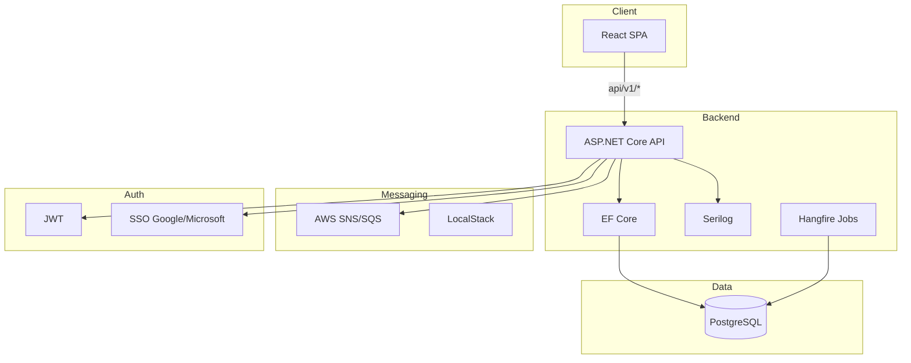

### Authentication Flow

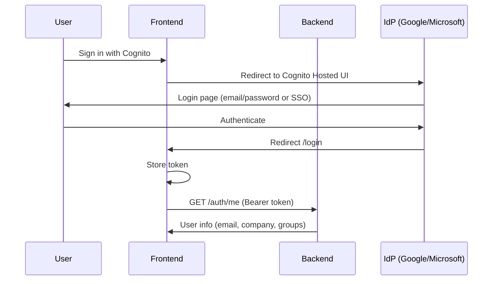

### Frontend

React SPA:

- Cognito JWT (id_token) authentication
- Protected routes
- Order management views
- Simple and intuitive UX

Responsibilities:
- Display order rounds
- Add/edit order items
- Show deadline countdown
- Provide summary export

---

### Backend

ASP.NET Core Web API (.NET 10):

Responsibilities:
- Authentication (AWS Cognito JWT; SSO via Cognito Identity Providers)
- Order management logic
- Validation & authorization
- Business rules enforcement
- Structured logging (Serilog)
- Health probes (/health, /health/ready, /health/live)

---

### Database

Entities:

User (AppUser, Cognito-provisioned)
- Id
- Email
- Company
- EmailConfirmed

OrderRound
- Id
- RestaurantName
- RestaurantUrl
- CreatedByUserId
- Deadline
- Status (Open / Closed)

OrderItem
- Id
- OrderRoundId
- UserId
- Description
- Price
- Notes

---

## ⚖️ Decisions & Trade-offs

### SPA + API Separation

Pros:
- Clean separation of concerns
- Easier future mobile/PWA expansion
- Frontend and backend scalable independently

Trade-off:
- Requires JWT handling and CORS setup

---

### Monolithic Backend (for MVP)

Pros:
- Simpler deployment
- Lower operational overhead

Trade-off:
- Would modularize into services only if scale increases

---

### PostgreSQL + Docker

Pros:
- Consistent environment across dev and production
- Strong concurrency and transaction support
- One-command setup via `docker compose up`
- Easy to add Redis, MailHog, etc. to the stack

Trade-off:
- Requires Docker; local dev without Docker needs PostgreSQL installed

---

## 🚀 What I Would Do Next

| Item | Approach |
|------|----------|
| **Microsoft Teams bot** | Bot Framework / Bot Builder SDK; webhook endpoint; extend OrderRounds API |
| **Payment (Stripe)** | Stripe Checkout or Elements; Payment entity; webhook for `payment_intent.succeeded` |
| **Recurring orders** | Background scheduler (Hangfire/Quartz); RecurringOrder template; cron-style rules |
| **Multi-tenant RBAC** | TenantId on entities; row-level security; admin dashboard for tenant management |
| **AWS deployment** | ECS/Fargate or EKS; RDS PostgreSQL; S3 + CloudFront for frontend; SES for email |

## Low-Level Diagrams

See system-architecture-diagrams section below for domain model, ER, sequence, process, component, state, and pipeline diagrams.

## ✅ Implemented Beyond MVP

- SSO (Google & Microsoft, production only)
- Serilog structured logging
- Health probes (readiness/liveness)
- SonarAnalyzer & .editorconfig
- React error boundaries
- API versioning & Swagger descriptions
- **global.json** – SDK version pinning
- **JsonPropertyName** – camelCase annotations on all DTOs
- **Event-driven** – MassTransit + SNS/SQS; domain events published and consumed asynchronously
- **Hangfire** – Jobs persisted in PostgreSQL; recurring rounds, deadline reminders

---

<a id="docsfuture_featuresmd"></a>
# docs/future_features.md

# 1.2 Future Functionalities

## ✅ Implemented (Beyond Original MVP)

- **SSO** – Google and Microsoft OAuth; disabled in development; token via URL fragment
- **Serilog** – Structured logging with request logging
- **Health Probes** – `/health`, `/health/ready`, `/health/live` for Docker/K8s
- **Error Boundaries** – React error boundaries with fallback UI
- **API Docs** – Swagger descriptions and ProducesResponseType
- **Rate Limiting** – Auth endpoints (login, register)
- **CORS** – Configurable origins; restricted in production
- **Secrets** – Production config via environment variables
- **Stripe Payments** – Payment entity, PaymentIntent creation, webhook for `payment_intent.succeeded`
- **Recurring Orders** – RecurringOrderTemplate entity, Hangfire cron job for automated round creation
- **Notifications** – Email reminders before deadlines (background job every 15 min)
- **Microsoft Teams Bot** – Bot Framework webhook, list rounds, link account via code
- **Event-driven** – MassTransit; production: AWS SNS/SQS (pub/sub); development: LocalStack; tests: InMemory. Apache 2.0 only.
- **global.json** – SDK version pinning
- **JsonPropertyName** – camelCase on all DTOs
- **Technical debt resolved** – Hangfire PostgreSqlStorage, CloudAdapter, Stripe webhook model binding, MassTransit refactor

---

## 🧩 Feature Roadmap

### 1️⃣ Microsoft Teams Integration ✅

Implemented: Bot Framework webhook, `/api/v1/bot` endpoint, list rounds, link account via code.

### 2️⃣ Payment Handling ✅

Implemented: Stripe PaymentIntent, webhook, Payment entity.

### 3️⃣ Recurring Orders ✅

Implemented: RecurringOrderTemplate CRUD, Hangfire job for cron-based round creation.

### 4️⃣ Multi-Tenant Support ✅

Implemented: Tenant entity, TenantId on all entities, tenant-aware authorization, Admin role, `GET /api/v1/admin/tenants`. Optional: row-level security in PostgreSQL.

---

### 5️⃣ Notifications ✅

Implemented: Email reminders before deadline (configurable minutes). In-app alerts via `GET /api/v1/notifications/unread` and `POST /api/v1/notifications/{id}/read`. Push subscription and delivery: PushNotificationService, service worker, PushEnableButton. DeadlineReminderJob sends email, in-app (SignalR), and web push.

---

<a id="docshigh_level_platformmd"></a>
# docs/high_level_platform.md

<a id="2-high-level-task--aws-cloud-platform-for-digital-pathology-ai"></a>
# 2. High-Level Task – AWS Cloud Platform for Digital Pathology AI

Cloud-native AI platform for Whole Slide Image (WSI) analysis, built on AWS to ensure scalability, security, and compliance with medical data requirements.

**Tech stack:** AWS, ASP.NET Core (.NET 10), React (TypeScript), GPU-based inference on EKS

---

## 2.1 System Architecture

### Goals

- Secure medical data handling
- Scalable GPU inference
- Efficient WSI management (up to 100,000 × 100,000 pixels)
- Enterprise integration (HIS/EHR)
- Future multi-modal AI support (natural language interaction)

### End Users

- Pathologists and medical doctors
- Hospitals and diagnostic laboratories
- Potentially end-consumers seeking direct diagnostic services

### Model Tasks

- **Segmentation** – Region delineation in tissue
- **Classification** – Slide or region categorization
- **Detection** – Localization of structures or anomalies

### Core Platform Flow

1. Upload pathology images securely
2. Trigger automated AI-based analysis
3. Visualize and interpret results through an intuitive web interface

---

### Main Components and Tool Choices

| Component | AWS Service | Why |
|-----------|-------------|-----|
| WSI Storage | S3 | Object storage for large binaries; lifecycle policies; HTTP range requests for partial reads |
| Metadata | RDS PostgreSQL | Relational model for jobs, users, audit; ACID; row-level security for multi-tenant |
| Inference | EKS + GPU node groups | Orchestration, auto-scaling, GPU workloads |
| Job Queue | SQS | Decouples API from workers; retries; backpressure |
| Auth | Cognito | Healthcare identity, MFA, compliance; B2B support |
| Real-time | AppSync (GraphQL) or WebSocket API | Push job status to UI |
| CDN | CloudFront | Tile delivery for WSI viewer; lower latency; access logs to S3 |
| Monitoring | CloudWatch, X-Ray | Logs (Serilog), metrics, DLQ alarm, tracing |

---

### Architecture Diagram

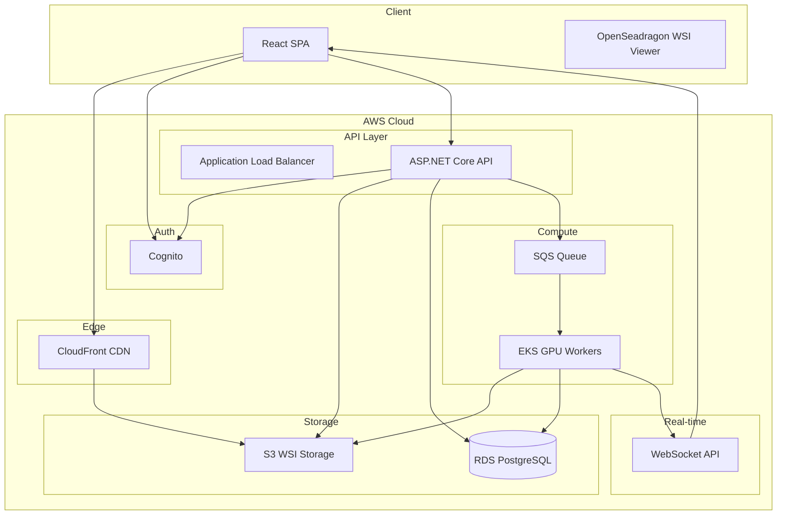

---

### System Flow

1. User logs in via Cognito
2. Upload WSI via presigned S3 URL
3. Metadata stored in RDS PostgreSQL
4. API publishes job to SQS
5. GPU worker (EKS) processes image tiles
6. Results stored in S3
7. Job status updated in RDS
8. WebSocket/AppSync notifies frontend

---

## 2.2 Scalable GPU-Based Inference

### Strategy

- Containerized inference service
- EKS GPU node groups (e.g. p3/p4 instances)
- Auto-scaling based on SQS queue length (KEDA or custom)
- Spot/Preemptible instances for cost optimization
- Maintain a small warm GPU pool for low latency

### Large Image Handling

- **Scale:** WSIs up to 100,000 × 100,000 pixels
- **Tile-based processing:** 256×256 or 512×512 tiles
- **Range requests** from S3 for partial reads
- **Parallel tile inference** across GPU workers
- **Aggregated result stitching** for final output

### Cost Efficiency

- Spot instances for non-critical workloads
- Scale-to-zero or minimum when idle
- Tiered storage (S3 Standard vs Glacier for archives)
- Reserved capacity for predictable load

### User Progress and Status

- WebSocket/AppSync push notifications
- Optional email alerts on completion
- Job status API with polling fallback

---

## 2.3 Large File Handling

WSIs are multi-resolution and very large. Viewers (e.g. [LazySlide](https://lazyslide.readthedocs.io/en/latest/tutorials/intro_wsi.html)) load only the visible region at the appropriate resolution. When the view changes, different parts/resolutions are loaded as small compressed chunks.

### Client-Side Bottlenecks

- **Bandwidth and latency** for tile fetches
- **Concurrent request limits** (browser, CDN)
- **Client memory** for decoded tiles
- **Prefetching** for smooth panning/zooming

### Cloud-Side Bottlenecks

- **S3 I/O** for range requests
- **CloudFront cache hit rate** for popular tiles
- **Origin load** on cache miss
- **Egress cost** for large tile volumes

### Mitigation Mechanisms

- **HTTP range requests** for partial reads
- **Tile pyramid** (multi-resolution levels)
- **Client-side LRU tile cache**
- **CloudFront** for tile delivery
- **Prefetch adjacent tiles** on view change
- **WebGL acceleration** in the viewer (e.g. OpenSeadragon)

---

<a id="24-project-management"></a>
## 2.4 Project Management

Assume it would be your responsibility to build such a platform within the features mentioned above and we have some resources available. Below is how the work would be split up.

---

### Which Parts to Build First (Prioritization / MVP Thinking)

**Phase 1 – MVP (Food Ordering + WSI Foundation)**

| Order | Component | Rationale |
|-------|-----------|-----------|
| 1 | Auth (Cognito) | Unblocks all user-facing features; required for multi-tenant |
| 2 | Core API + PostgreSQL | Backbone for order rounds, WSI metadata, jobs |
| 3 | Food ordering (rounds, items) | Primary use case; validates vertical slice architecture |
| 4 | Upload pipeline (S3 presigned URLs) | Enables WSI ingestion without overloading API |
| 5 | Basic WSI viewer (OpenSeadragon) | Demonstrates end-to-end value; out-of-the-box |
| 6 | Single GPU worker + manual analysis trigger | Proves inference pipeline; minimal complexity |

**Goal:** End-to-end working system – users can order food and run a WSI analysis.

**Phase 2 – Scalability & Reliability**

- SQS queue (decouple API from workers)
- EKS auto-scaling for GPU workers
- WebSocket/SignalR for real-time job status
- Monitoring (CloudWatch, Serilog)
- CI/CD (GitHub Actions → ECR, EKS)

**Phase 3 – Advanced Features**

- Teams bot, payments, recurring orders, notifications (food domain)
- Multi-modal AI, LLM integration, annotation collaboration (WSI domain)
- Compliance hardening (GDPR, HIPAA, MDR/IVDR)
- Enterprise audit logging

---

### Where to Use Out-of-the-Box Solutions

| Area | Solution | Rationale |
|------|----------|-----------|
| **WSI viewer** | OpenSeadragon (OSS) | Mature, pyramid/tile support, no reinvention |
| **Auth** | AWS Cognito | Managed, compliant, SSO, MFA |
| **Storage** | S3 | Managed object storage, lifecycle, range requests |
| **Job queue** | SQS (via MassTransit) | Managed messaging, retries, backpressure |
| **Database** | RDS PostgreSQL | Managed, backups, multi-AZ |
| **CDN** | CloudFront | Tile delivery, lower latency |
| **Email** | Amazon SES | Managed, deliverability |
| **Payments** | Stripe | PCI-compliant, webhooks |
| **Teams bot** | Bot Framework / CloudAdapter | Microsoft-supported integration |

---

### Where to Build Custom Components

| Area | Custom Build | Rationale |
|------|--------------|-----------|
| **Inference runtime** | Custom container (Python/.NET) | Model-specific, GPU scheduling, preprocessing |
| **API orchestration** | ASP.NET Core backend | Domain logic, multi-tenant, event-driven workflows |
| **Annotation UI** | Custom React components | Clinical workflow, regulatory requirements |
| **Order round logic** | Domain handlers | Business rules, event sourcing |
| **WSI tile generation** | Custom pipeline (if needed) | Proprietary formats, optimization |
| **Multi-tenant data isolation** | Application-level | Row-level security, tenant context |

---

### Which Work I Would Perform Myself

- **Architecture & design** – System boundaries, event flows, API contracts
- **Core backend** – ASP.NET Core API, EF Core, MassTransit consumers, domain logic
- **Integration orchestration** – Cognito, S3, SQS, Stripe, Teams
- **Infrastructure as Code** – Pulumi/Terraform for AWS
- **CI/CD pipelines** – GitHub Actions, Docker builds, EKS deployments
- **Technical documentation** – Architecture, runbooks, API docs

---

### Which Parts to Outsource to Freelancers

| Area | Scope | Rationale |
|------|-------|-----------|
| **Frontend polish** | UI/UX refinements, accessibility | Specialized skills; can be scoped in sprints |
| **One-off integrations** | Third-party APIs, export formats | Well-defined contracts; low ongoing maintenance |
| **Documentation** | User guides, how-to content | Non-technical writers; follows docs-how-to rules |
| **Design assets** | Icons, illustrations, branding | Designers; deliverables are discrete |
| **Localization** | i18n, translations | Translators; no code changes |

---

### Whether Hiring Someone with Specific Expertise Makes Sense

| Role | When | Why |
|------|------|-----|
| **DevOps / ML infrastructure** | Early (Phase 2) | CI/CD, GPU clusters, EKS scaling, IRSA, cost optimization |
| **Security / compliance** | Before production | Medical data (WSI), GDPR, HIPAA, MDR/IVDR, audit trails |
| **Frontend performance** | When viewer UX is critical | Large images, tile loading, WebGL, responsiveness |
| **Clinical advisor** | For WSI validation | Workflow accuracy, clinical terminology, regulatory input |
| **ML engineer** | Phase 3 (advanced AI) | Model training, fine-tuning, multi-modal pipelines |

**Recommendation:** Hire DevOps/ML infrastructure early; security/compliance before go-live; clinical advisor for validation; frontend performance and ML engineer when scaling demands it.

---

<a id="25-vision--next-steps"></a>
## 2.5 Vision & Next Steps

### Vision

**MIRA** aims to be a unified platform that serves two complementary domains:

| Domain | Vision |
|--------|--------|
| **HIVE Food Ordering** | The default coordination hub for food orders across companies in HIVE Göppingen – simple, reliable, and embedded in daily workflows (web + Teams). Extensible to other coworking spaces. |
| **WSI Digital Pathology** | A cloud-native AI platform for Whole Slide Image analysis – from upload to inference to visualization – enabling pathologists and labs to run AI-assisted diagnostics at scale, with compliance and enterprise integration. |

**Unifying principles:**

- **Single platform** – Shared backend, auth (Cognito), database (PostgreSQL), and AWS infrastructure
- **Event-driven** – Decoupled workflows via SNS/SQS; scalable and resilient
- **Compliance-first** – Designed for medical data (WSI) and multi-tenant isolation from day one
- **Extensible** – Modular architecture for future features (multi-modal AI, HIS/EHR integration, mobile)

**Long-term direction:**

- **Food domain:** Recurring orders, richer Teams interactions, analytics, integration with local restaurants
- **WSI domain:** Multi-modal AI (natural language + vision), annotation collaboration, regulatory certification (MDR/IVDR), enterprise SSO and audit trails

---

### Next Steps

**Immediate (0–4 weeks)**

| # | Action | Owner | Notes |
|---|--------|-------|-------|
| 1 | Harden production config | DevOps | Secrets in AWS Secrets Manager; RDS, S3, Cognito verified |
| 2 | Enable CI/CD | DevOps | GitHub Actions → ECR, EKS/ECS; green pipeline on main |
| 3 | WSI worker in EKS | Backend/DevOps | Deploy worker container; IRSA for S3/SQS; verify end-to-end analysis |
| 4 | Real-time job status | Backend | SignalR or WebSocket for WSI job progress in UI |
| 5 | Security review | Security | Auth flows, tenant isolation, logging of sensitive access |

**Short-term (1–3 months)**

| # | Action | Owner | Notes |
|---|--------|-------|-------|
| 6 | EKS auto-scaling | DevOps | GPU node groups; scale workers on queue depth |
| 7 | CloudFront for WSI tiles | DevOps | CDN for tile delivery; lower latency |
| 8 | Compliance documentation | Compliance | Data flows, retention, GDPR/HIPAA alignment |
| 9 | Food: export improvements | Backend | PDF/Excel export; recurring order analytics |
| 10 | WSI: annotation UI | Frontend | Region drawing, labels, save to backend |

**Medium-term (3–6 months)**

| # | Action | Owner | Notes |
|---|--------|-------|-------|
| 11 | Clinical validation | Clinical advisor | Workflow review; terminology; regulatory input |
| 12 | Multi-modal AI (WSI) | ML engineer | LLM integration; natural language queries on slides |
| 13 | HIS/EHR integration | Backend | HL7/FHIR; order ingestion; result push |
| 14 | Mobile/PWA | Frontend | Offline-capable order rounds; push notifications |
| 15 | Cost optimization | DevOps | Spot instances; reserved capacity; usage dashboards |

**Ongoing**

- Monitor CloudWatch metrics and DLQ; tune scaling and timeouts
- Regular dependency updates (Dependabot); security patches
- User feedback loops for both food and WSI workflows

---

## Architectural Philosophy

- Use managed AWS services where possible
- Decouple compute from API
- Design for compliance from day one
- Keep ML services containerized
- Build modular for future multi-modal AI integration

---

<a id="how-we-define-approach-problem-solving-critical-thinking--creativity"></a>
## How We Define: Approach, Problem-Solving, Critical Thinking & Creativity

*The goal is to understand how we work—not to deliver a perfect or complete solution.*

| Term | Definition |
|------|------------|
| **Approach** | The deliberate way we tackle work: plan before implement, use vertical slices, favor clarity over cleverness. We choose tools and patterns that fit the problem, document decisions, and iterate based on feedback. |
| **Problem-solving** | Breaking down ambiguity into concrete steps: identify root cause (e.g. 503 from MassTransit health check, not PostgreSQL), test hypotheses, apply minimal fixes, verify. We prefer targeted fixes over broad rewrites. |
| **Critical thinking** | Questioning assumptions and evidence: "Is this the real cause?" "What does the log actually say?" "Does this fix the symptom or the cause?" We avoid cargo-cult solutions and verify before concluding. |
| **Creativity** | Finding practical alternatives within constraints: build vs buy, custom vs off-the-shelf, retry vs exclude, document vs code. Creativity here means choosing the right level of solution for the context. |

In practice, these overlap: a good approach includes problem-solving; critical thinking sharpens both; creativity helps when standard patterns don't fit.

---

<a id="docsproduction-configmd"></a>
# docs/production-config.md

# Production Configuration

Production follows [AWS Cloud Platform](#2-high-level-task--aws-cloud-platform-for-digital-pathology-ai). Use environment variables or AWS Secrets Manager. Never commit secrets to source control.

## Required Environment Variables

| Variable | Description |
|----------|-------------|
| `ConnectionStrings__DefaultConnection` | RDS PostgreSQL connection string |
| `AWS__Cognito__UserPoolId` | Cognito User Pool ID (required) |
| `AWS__Cognito__Region` | AWS region (required) |
| `AWS__Cognito__ClientId` | App client ID (for audience validation) |
| `Cors__AllowedOrigins__0` | Allowed frontend origin (e.g. `https://app.example.com`) |
| `Cors__AllowedOrigins__1` | Additional origin if needed |

SSO (Google, Microsoft) is configured in the Cognito User Pool as Identity Providers; use Cognito Hosted UI.

### Auth: AWS Cognito (Required)

Auth uses Cognito only. Configure a Cognito User Pool and set `AWS__Cognito__UserPoolId`, `AWS__Cognito__Region`, `AWS__Cognito__ClientId`. Frontend: set `VITE_USE_COGNITO=true`, `VITE_COGNITO_USER_POOL_ID`, `VITE_COGNITO_CLIENT_ID`, `VITE_COGNITO_DOMAIN`.

## Messaging – Event-Driven (Pub/Sub)

Transport selection (in order of precedence):

1. **AWS SNS + SQS** (production) – when `AWS__Region` is set
2. **LocalStack** (local Docker) – when `AWS__ServiceUrl` is set
3. **InMemory** (tests) – when neither is configured

### Production: AWS SNS + SQS

Uses **MassTransit.AmazonSQS** and **AWS SDK** (both Apache 2.0, open source). MassTransit publishes to SNS topics and consumes from SQS queues; SNS fans out to SQS subscriptions (pub/sub). No commercial or paid libraries.

| Variable | Description |
|----------|-------------|
| `AWS__Region` | AWS region (e.g. `us-east-1`) |
| `AWS__AccessKey` | IAM access key (optional; use IAM role or `AWS_ACCESS_KEY_ID` env) |
| `AWS__SecretKey` | IAM secret key (optional; use IAM role or `AWS_SECRET_ACCESS_KEY` env) |
| `AWS__Scope` | Optional prefix for queue/topic names (e.g. `hive-orders`) |

**IAM permissions** required: `sqs:*`, `sns:*` on the relevant resources. Prefer IAM roles (ECS task role, EC2 instance profile) over access keys.

### S3 (Large File / WSI Uploads)

| Variable | Description |
|----------|-------------|
| `AWS__S3__BucketName` | Uploads bucket name |
| `AWS__S3__Region` | S3 region (or use `AWS__Region`) |
| `AWS__S3__PresignedUrlExpirationMinutes` | Presigned URL expiry (default 60) |
| `AWS__S3__MaxSinglePutBytes` | Max file size for single PUT (default 5 GB) |

### Development: LocalStack (SQS/SNS)

| Variable | Description |
|----------|-------------|
| `AWS__Region` | Region (e.g. `us-east-1`) |
| `AWS__ServiceUrl` | LocalStack endpoint (e.g. `http://localstack:4566` in Docker) |
| `AWS__AccessKey` | Access key (e.g. `test`) |
| `AWS__SecretKey` | Secret key (e.g. `test`) |

## Optional (Email)

| Variable | Description |
|----------|-------------|
| `Email__SmtpHost` | SMTP host (e.g. Amazon SES) |
| `Email__SmtpPort` | SMTP port |
| `Email__FromAddress` | Sender email |

## Docker / Kubernetes

Set via `environment` in docker-compose or `env` in K8s Deployment. For K8s, prefer Secrets and ConfigMaps.

## AppSettings Structure

Configuration is consistent across `appsettings.json`, `appsettings.Development.json`, and `appsettings.Production.json`:

| Section | Purpose |
|---------|---------|
| `ConnectionStrings` | PostgreSQL (base only) |
| `Cors` | Allowed origins |
| `RateLimiting` | Auth endpoint limits |
| `AWS` | Cognito (required), S3, SQS |
| `AWS` (ServiceUrl) | Messaging (dev via LocalStack) |
| `Email` | SMTP / SES |
| `ErrorReporting` | Dev email for errors |
| `Notifications` | Reminder minutes |
| `Push` | Web push VAPID keys |
| `Stripe` | Payments |
| `Teams` | Microsoft Teams bot |
| `HttpClients` | External API clients |

Secrets (Cognito, Stripe, etc.) are empty in files; set via environment variables in production.

## CORS

In production, **Cors:AllowedOrigins** must be explicitly set via environment variables. The app will not start if origins are empty in Production.

**Example (env vars):**
```bash
Cors__AllowedOrigins__0=https://app.example.com
Cors__AllowedOrigins__1=https://admin.example.com
```

**Example (appsettings.Production.json):**
```json
{
  "Cors": {
    "AllowedOrigins": ["https://app.example.com"]
  }
}
```

## HTTP Clients (Refit) – Resilience

Refit clients use `Microsoft.Extensions.Http.Resilience` with `AddStandardResilienceHandler`. Configure via `HttpClients:{ClientName}:Resilience` in appsettings.json.

| Path | Default | Description |
|------|---------|-------------|
| `AttemptTimeout.Timeout` | 00:00:10 | Per-attempt timeout (TimeSpan) |
| `TotalRequestTimeout.Timeout` | 00:00:30 | Total timeout including retries |
| `Retry.MaxRetryAttempts` | 3 | Max retries on transient errors |
| `Retry.BackoffType` | Exponential | `Exponential` or `Linear` |
| `Retry.UseJitter` | true | Add jitter to retry delays |
| `Retry.Delay` | 00:00:02 | Base delay between retries |
| `CircuitBreaker.FailureRatio` | 0.1 | 10% failure ratio triggers open |
| `CircuitBreaker.MinimumThroughput` | 100 | Min requests before sampling |
| `CircuitBreaker.SamplingDuration` | 00:00:30 | Sampling window |
| `CircuitBreaker.BreakDuration` | 00:00:05 | Duration circuit stays open |

**Example:** `HttpClients:ExternalService:Resilience` in appsettings.json. Omit `RateLimiter` (API changed); defaults apply.

## Microsoft Teams Bot (CloudAdapter)

The Teams bot uses **CloudAdapter** (Bot Framework v4). Configure via `Teams` section:

| Variable | Description |
|----------|-------------|
| `Teams__MicrosoftAppId` | Microsoft App Registration ID |
| `Teams__MicrosoftAppPassword` | Microsoft App Registration secret |

**Example (appsettings.json):**
```json
{
  "Teams": {
    "MicrosoftAppId": "your-app-id",
    "MicrosoftAppPassword": "your-app-password"
  }
}
```

## Multi-Tenant

- **TenantId** – All tenant-scoped entities (OrderRound, Payment, RecurringOrderTemplate, etc.) include TenantId.
- **Cognito id_token** – Includes `tenant_id` claim (set by CognitoUserProvisioningMiddleware) for tenant-aware authorization.
- **Admins** – Users in the `Admins` Cognito group can access `/api/v1/admin/*`. Assign via Cognito AdminAddUserToGroup or `POST /api/v1/admin/users/{userId}/assign-admin` (existing admin only).
- **Row-level security** – Optional: enable PostgreSQL RLS with `current_setting('app.tenant_id')` for stricter isolation.

## Rate Limiting

Auth endpoints are rate limited. Configure via:

| Variable | Default | Description |
|----------|---------|-------------|
| `RateLimiting__Auth__PermitLimit` | 20 | Requests per window |
| `RateLimiting__Auth__WindowMinutes` | 1 | Window duration |

---

<a id="production-architecture"></a>
# Production Architecture

Production uses fully managed AWS infrastructure for scalability, security, and compliance.

| Component | AWS Service | Purpose |
|-----------|-------------|---------|
| Auth | **Cognito** | User pools, MFA, compliance |
| Storage | **S3** | Large binaries, presigned URLs |
| Metadata | **RDS PostgreSQL** | Relational data, jobs, users |
| Job Queue | **SQS** | Decouples API from workers |
| Compute | **EKS** (or ECS Fargate) | API and workers |
| Real-time | **AppSync** or **API Gateway WebSocket** | Push job status |
| CDN | **CloudFront** | Static assets, tile delivery |
| Monitoring | **CloudWatch**, **X-Ray** | Logs, metrics, tracing |

**Deploy workflow** (`.github/workflows/deploy.yml`): Builds and deploys on push to `main`. **Secrets:** `AWS_ROLE_ARN`, `ECR_REGISTRY`, `ECS_CLUSTER`, `ECS_SERVICE`, `ECS_WORKER_CLUSTER`, `ECS_WORKER_SERVICE`, `S3_BUCKET_FRONTEND`, `CLOUDFRONT_DISTRIBUTION_ID`. ECR repos: `mira-api`, `mira-wsi-worker`.

**Infrastructure** (`.github/workflows/deploy-infra.yml`): `pulumi preview` on PRs; manual `pulumi up` via workflow_dispatch. Requires `PULUMI_ACCESS_TOKEN`.

**EKS worker:** When `enableEksGpu=true`, deploy manually after `pulumi up`. See [EKS Kubernetes](#kubernetes-manifests-eks).

**Custom domains:** API and frontend via `domainName`, `hostedZoneId`, `apiSubdomain`, `frontendSubdomain`. CloudFront ACM certs must be in **us-east-1**.

**Auto-scaling:** Set `apiScalingMin`/`apiScalingMax` and `workerScalingMin`/`workerScalingMax` in Pulumi for CPU-based ECS scaling (70%).

**EKS IRSA:** When `enableEksGpu=true`, annotate service account: `kubectl annotate serviceaccount wsi-worker -n mira eks.amazonaws.com/role-arn=$(pulumi stack output eksWsiWorkerRoleArn) --overwrite`.

---

<a id="system-architecture"></a>
# System Architecture

Cloud-native platform for WSI analysis on AWS.

| Component | Tool / Service |
|-----------|----------------|
| Client | React (TypeScript), OpenSeadragon |
| Edge | CloudFront |
| API | ASP.NET Core (.NET 10) |
| Auth | AWS Cognito |
| Storage | S3 |
| Metadata | RDS PostgreSQL |
| Job Queue | SQS |
| Compute | EKS (or ECS Fargate) |
| Real-time | SignalR / API Gateway WebSocket |
| Monitoring | CloudWatch, X-Ray |

**Implementation status:** Auth, upload pipeline, WSI metadata/jobs, manual analysis trigger, job queue (MassTransit/SQS), WSI viewer, GPU worker (mock in dev / .NET Worker in prod).

---

<a id="scalable-gpu-based-inference"></a>
# Scalable GPU-Based Inference

Inference is triggered when a customer requests analysis. Decoupled API and workers via SQS; EKS GPU node groups; auto-scaling (KEDA or custom); tile-based processing; HTTP range requests from S3. **Cost:** Spot instances, scale-to-zero, tiered storage. **User progress:** WebSocket/AppSync push, job status API, optional email.

---

<a id="large-file-handling"></a>
# Large File Handling

WSIs are multi-resolution and very large. Viewers load only the visible region. **User-side bottlenecks:** Bandwidth, concurrent request limits, client memory, prefetching. **Cloud bottlenecks:** S3 I/O, CloudFront cache hit rate, egress cost. **Mitigations:** HTTP range requests, tile pyramid, client LRU cache, CloudFront, WebGL (OpenSeadragon).

## Implementation (Consistent Large File Handling)

### Two-Phase Upload Flow

1. **POST /api/v1/wsi/upload-url** – Request presigned URL with `fileName`, `contentType`, `fileSizeBytes`. API creates `WsiUpload` with `Status=Uploading`, returns `{ url, key, uploadId }`.
2. **Client PUT** – Upload file directly to S3 using presigned URL.
3. **POST /api/v1/wsi/uploads/{id}/confirm** – API verifies object exists (HeadObject), sets `Status=Ready`, returns upload.

### Validation

| Check | Limit | Response |
|-------|-------|----------|
| File size | 5 GB (configurable via `AWS:S3:MaxSinglePutBytes`) | 400 Bad Request |
| File name length | 256 chars | 400 Bad Request |
| Max uploads per user | 100 | 400 Bad Request |
| S3 object not found on confirm | - | 400 Bad Request, record deleted |

### Configuration

| Variable | Default | Description |
|----------|---------|-------------|
| `AWS:S3:PresignedUrlExpirationMinutes` | 60 | Presigned URL expiry (1–1440) |
| `AWS:S3:MaxSinglePutBytes` | 5368709120 (5 GB) | Max file size for single PUT |

### Orphan Cleanup

Hangfire job `wsi-orphan-cleanup` runs daily. Deletes `WsiUpload` records with `Status=Uploading` older than 24 hours and their S3 objects.

### Worker: Fail Fast on S3 404

If the worker cannot find the S3 object, it publishes `WsiAnalysisFailedEvent` immediately instead of continuing. Prevents phantom success for missing files.

### S3 CORS

Uploads bucket has CORS configured for frontend origins (production: `https://{frontendSubdomain}.{domain}`; dev: `http://localhost:5173`, etc.).

### Structured Errors

| Code | HTTP | Message |
|------|------|---------|
| `STORAGE_UNAVAILABLE` | 503 | S3 storage not configured |
| `UPLOAD_NOT_FOUND` | 400 | S3 object not found on confirm |
| `UPLOAD_NOT_READY` | 400 | Upload must be Ready before analysis |

---

<a id="wsi-gpu-worker--production-deployment"></a>
# WSI GPU Worker – Production Deployment

When `Wsi:UseMockWorker=false`, a **separate worker** must consume `WsiAnalysisRequestedEvent` from SQS and publish `WsiAnalysisCompletedEvent` or `WsiAnalysisFailedEvent`.

**Option A – .NET Worker:** Deploy `workers/wsi/HiveOrders.WsiWorker` to ECS Fargate or EKS. MassTransit + AmazonSQS; same `AWS:Scope` as API.

**Option B – Python:** Consume from SQS (boto3); parse MassTransit JSON envelope; publish completion via bridge queue or .NET helper.

**Option C – EKS GPU Pod:** Container with CUDA + inference runtime; KEDA for SQS-based scaling.

**Config:** `AWS__Region`, `AWS__Scope`, `AWS__S3__BucketName`; IAM role for ECS/EKS.

---

<a id="infrastructure-pulumi--aws"></a>
# Infrastructure (Pulumi + AWS)

TypeScript IaC for dev, staging, production. **Prerequisites:** Node.js 18+, Pulumi CLI, AWS CLI.

**Stacks:** `dev`, `staging`, `prod`. **Required:** `dbPassword` (secret). **Optional:** `awsRegion`, `projectName`, `domainName`, `hostedZoneId`, `enableEksGpu`, `enableWebSocketApi`, `enableXRayTracing`, `apiScalingMin`/`Max`, `workerScalingMin`/`Max`, etc.

**Resources:** VPC, RDS PostgreSQL, S3, SQS, Cognito, ECR, ECS Fargate, CloudFront, CloudWatch, Secrets Manager. Optional: EKS GPU cluster, API Gateway WebSocket.

**Post-deploy:** CI/CD (`.github/workflows/deploy.yml`) or manual: build/push images to ECR, sync frontend to S3, invalidate CloudFront.

---

<a id="kubernetes-manifests-eks"></a>
# Kubernetes Manifests (EKS)

When `enableEksGpu=true`:

```bash
export ECR_WORKER_IMAGE=$(pulumi stack output ecrWorkerRepositoryUrl):latest
export AWS_REGION=us-east-1
export S3_BUCKET=$(pulumi stack output uploadsBucketName)
aws eks update-kubeconfig --name $(pulumi stack output eksClusterName) --region $AWS_REGION
kubectl annotate serviceaccount wsi-worker -n mira eks.amazonaws.com/role-arn=$(pulumi stack output eksWsiWorkerRoleArn) --overwrite
envsubst < infrastructure/k8s/wsi-worker-deployment.yaml | kubectl apply -f -
```

**IRSA:** Pods use `eksWsiWorkerRoleArn` for S3/SQS when service account is annotated.

---

<a id="wsi-worker"></a>
# WSI Worker

Production worker at `workers/wsi/`. Consumes `WsiAnalysisRequestedEvent`, runs inference, publishes `WsiAnalysisCompletedEvent` or `WsiAnalysisFailedEvent`.

**Config:** `AWS__Region`, `AWS__Scope`, `AWS__ServiceUrl` (LocalStack), `Wsi__InferenceServiceUrl` (optional HTTP inference).

**Modes:** (1) Simulated – no InferenceServiceUrl; (2) HTTP service – POST to `{url}/analyze`; (3) Extend – override `RunInferenceAsync`.

**Run:** `cd workers/wsi && dotnet run`. **Deploy:** ECR → ECS Fargate or EKS.

---

<a id="mira-frontend"></a>
# MIRA Frontend

React SPA: React (TypeScript), Vite, React Router, TailwindCSS, React Query, Axios.

**Setup:** `npm install`. `.env`: `VITE_API_URL`, `VITE_USE_COGNITO`, `VITE_COGNITO_*`.

**Dev:** `npm run dev` → http://localhost:5173. **Build:** `npm run build` → `dist/`. Deploy to S3 + CloudFront.

**Features:** Auth (Cognito or dev token), Order Rounds, WSI upload/viewer, protected routes, error boundaries.

## Frontend Structure

```
frontend/src/
├── components/       # Shared UI (app-layout, file-upload-button)
├── features/        # Feature modules
│   ├── auth/        # Login, Cognito
│   ├── order-rounds/
│   └── wsi/         # WSI upload, viewer, list
│       ├── components/  # wsi-viewer (OpenSeadragon)
│       └── routes/     # wsi-upload-page, wsi-viewer-page, wsi-uploads-page
├── lib/             # API clients, utilities
│   ├── api.ts       # Axios instance
│   ├── wsi.ts       # WSI upload/download, validation, error mapping
│   └── ...
└── providers/       # React context (auth, notifications)
```

## WSI Upload

**Flow:** `uploadWsiFileWithProgress` → `validateFileSize` → `getWsiUploadUrl` → `uploadWsiFile` (XHR with progress) → `confirmWsiUpload`.

**Validation:** `validateFileSize` rejects files > 5 GB before upload.

**Progress:** `uploadWsiFile` uses `XMLHttpRequest.upload` progress events; `WsiUploadPage` shows a progress bar.

**Errors:** `mapUploadError` maps API errors (403, 413, 503) and `response.data.message` to user-friendly messages.

---


<a id="low-level-system-architecture--uml-diagrams"></a>
# Low-Level System Architecture – UML Diagrams

This document contains process diagrams, flowcharts, sequence diagrams, and domain model diagrams for the HIVE Food Ordering system. Each diagram is followed by a written explanation.

---

## 1. Domain Model (Class Diagram)

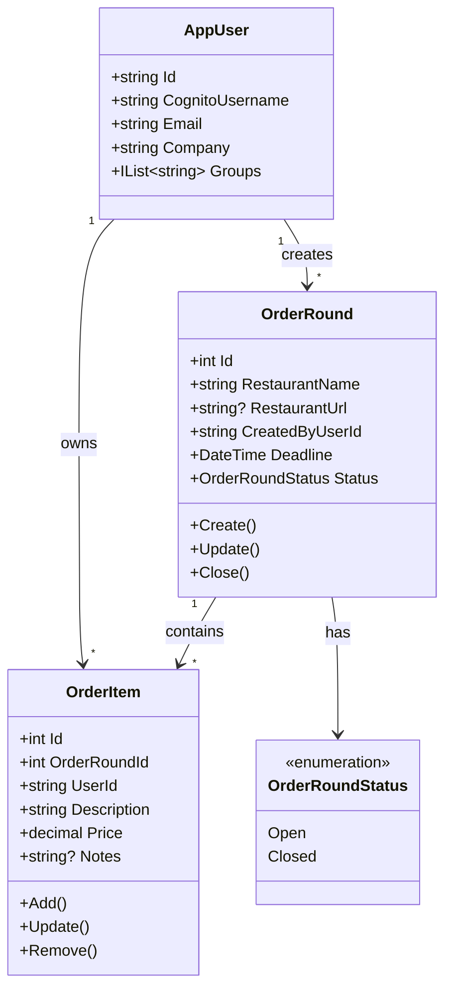

### Event-Driven Flow

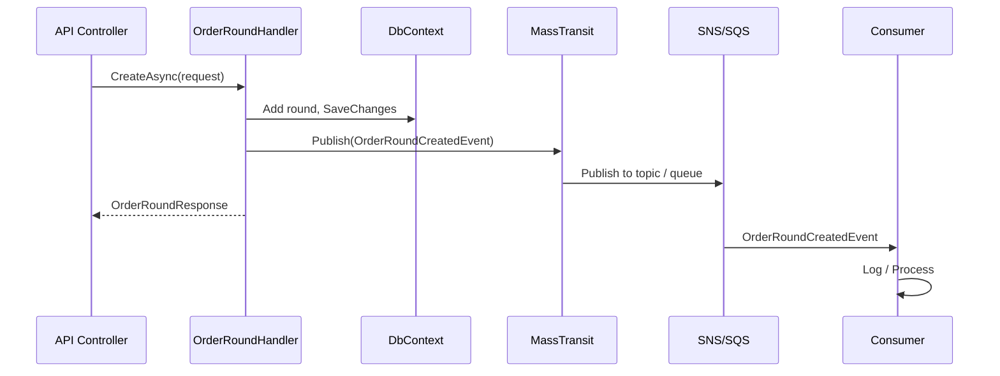

**Explanation:** After a handler persists state, it publishes domain events via MassTransit. **Production**: events go to AWS SNS (topics), which fan out to SQS queues; consumers process from SQS. **Development**: LocalStack (SQS/SNS emulation). **Tests**: InMemory. All transports use open-source libraries (MassTransit, AWS SDK: Apache 2.0).

---

**Explanation:** This class diagram shows the core domain entities and their relationships. **AppUser** is provisioned from AWS Cognito (Id = Cognito sub); it has `Company` and `Groups` (cached from cognito:groups). Each user can create many **OrderRounds** (one-to-many) and own many **OrderItems** (one-to-many). An **OrderRound** has a restaurant name, URL, deadline, and status (Open or Closed); it contains many **OrderItems**. Each **OrderItem** belongs to one round and one user, and has description, price, and optional notes. The arrows indicate cardinality: `1` → `*` means one entity relates to many.

---

## 2. Entity Relationship Diagram

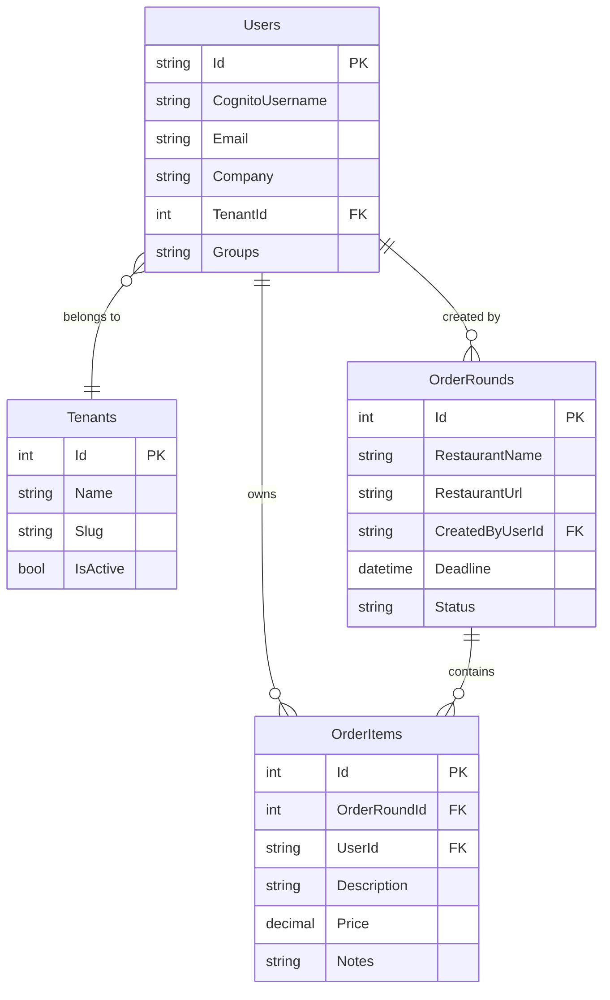

**Explanation:** This ER diagram shows the database schema. **Users** stores Cognito-provisioned users (Id = Cognito sub); **Groups** is a comma-separated list of Cognito group names (e.g. Admins, Managers, Users). **OrderRounds** has a foreign key to the user who created it. **OrderItems** references both the order round and the user who added it. PK = primary key, FK = foreign key. The `||--o{` notation means "one to many" (one user creates many rounds; one round contains many items).

---

## 3. Sequence Diagrams

Sequence diagrams show the order of messages between components over time. Read from top to bottom; arrows indicate requests (solid) and responses (dashed). `alt` blocks show alternative paths.

### 3.1 Cognito Login Flow

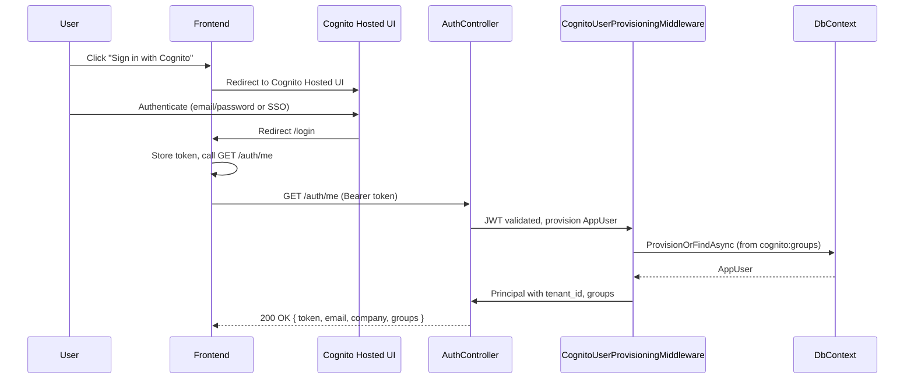

**Explanation:** Authentication uses AWS Cognito for all environments. The user clicks "Sign in with Cognito" and is redirected to Cognito Hosted UI. After authenticating (email/password or SSO via Cognito Identity Providers), Cognito redirects back with an id_token. The frontend stores the token and calls `GET /auth/me`. The backend validates the JWT, provisions or finds the AppUser from Cognito claims (including cognito:groups), and returns user info. Groups (e.g. Admins, Managers, Users) are used for authorization.

### 3.2 Create Order Round Flow

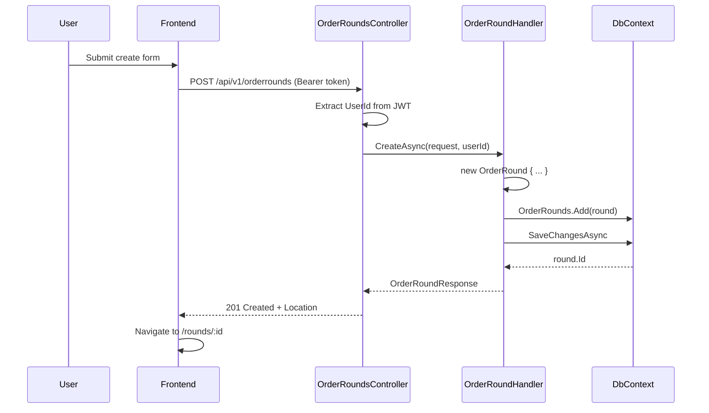

**Explanation:** The user submits the create-round form. The frontend sends `POST /api/v1/orderrounds` with the JWT in the Authorization header. The controller extracts the user ID from the token and delegates to OrderRoundHandler. The handler creates an OrderRound, saves it to the database, and returns the response. The API responds with 201 Created and a Location header; the frontend navigates to the new round's detail page.

### 3.3 Add Item to Order Round Flow

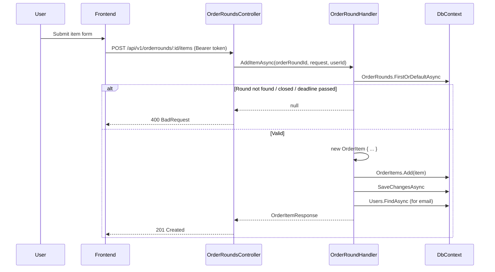

**Explanation:** The user adds an item on the order round detail page. The frontend sends `POST /api/v1/orderrounds/:id/items` with the JWT. The handler first checks that the round exists, is Open, and the deadline has not passed. If any check fails, it returns 400. Otherwise, it creates the OrderItem, saves it, and returns 201 Created.

---

## 4. Process Diagrams (Flowcharts)

Flowcharts show decision points and process steps. Diamonds are decisions; rectangles are actions. Arrows show flow direction.

### 4.1 User Registration Process

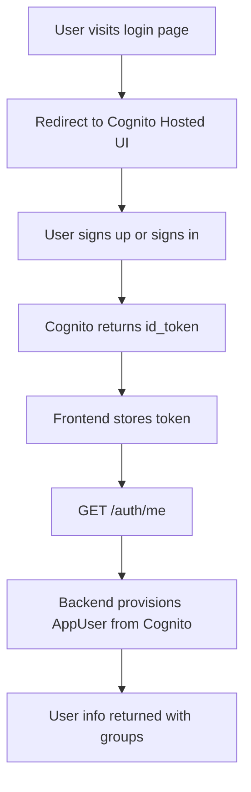

**Explanation:** Registration and login are handled by AWS Cognito. Users sign up and sign in via Cognito Hosted UI. The frontend receives an id_token, stores it, and calls `GET /auth/me` to provision the AppUser and get user info (including groups).

### 4.2 Order Round Lifecycle

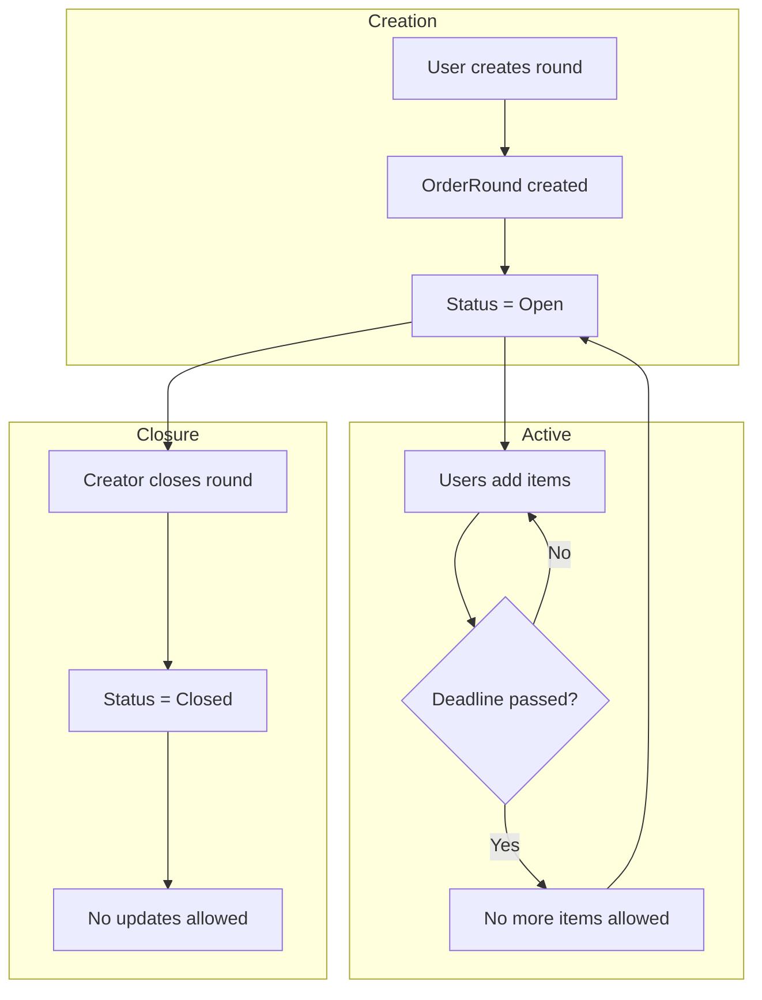

**Explanation:** An order round starts in **Open** state when created. While open, users can add, update, or remove items until the deadline passes. After the deadline, no new items can be added, but the round stays Open. Only the creator can **close** the round (Status = Closed). Once closed, no updates are allowed.

### 4.3 Add Item Decision Flow

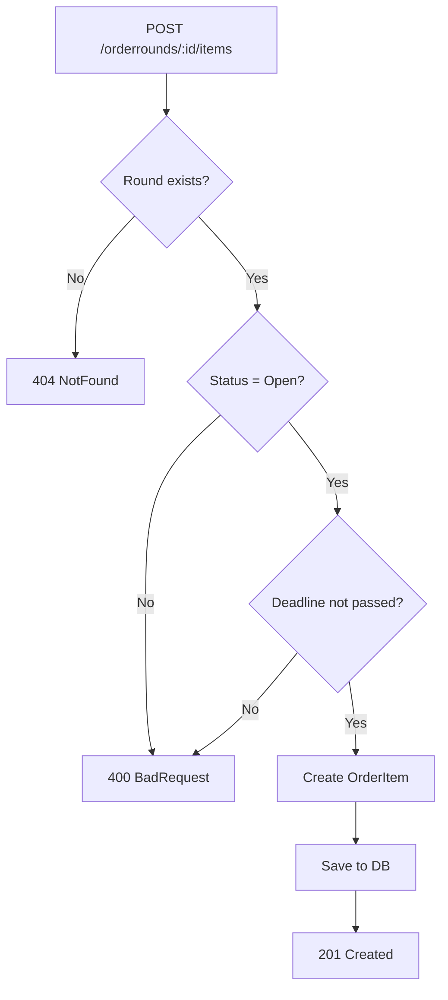

**Explanation:** Adding an item requires three checks: (1) the round must exist (otherwise 404), (2) the round must be Open (otherwise 400), and (3) the deadline must not have passed (otherwise 400). Only if all pass does the system create the item and return 201.

### 4.4 Authentication Decision Flow

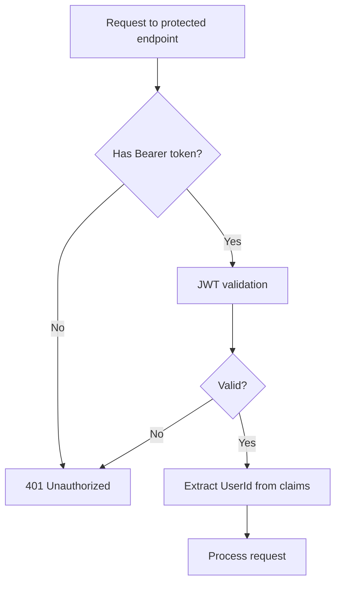

**Explanation:** Every request to a protected endpoint (e.g. order rounds) must include a valid Bearer token. If missing or invalid, the API returns 401. If valid, the user ID is extracted from the JWT claims and the request proceeds.

---

## 5. Component Diagram

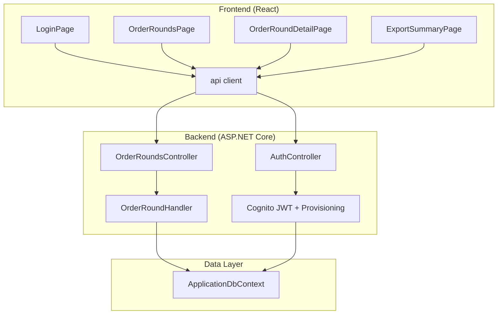

**Explanation:** The component diagram shows how the application is split into layers. The **frontend** has main pages and a shared API client (Axios). Login redirects to Cognito Hosted UI; the API client calls AuthController (`/auth/me`) and OrderRoundsController. The **backend** uses Cognito JWT validation and CognitoUserProvisioningMiddleware to provision AppUser from Cognito claims. The **data layer** uses ApplicationDbContext (EF Core) with a Users table (no ASP.NET Identity).

---

## 6. State Diagram – OrderRound

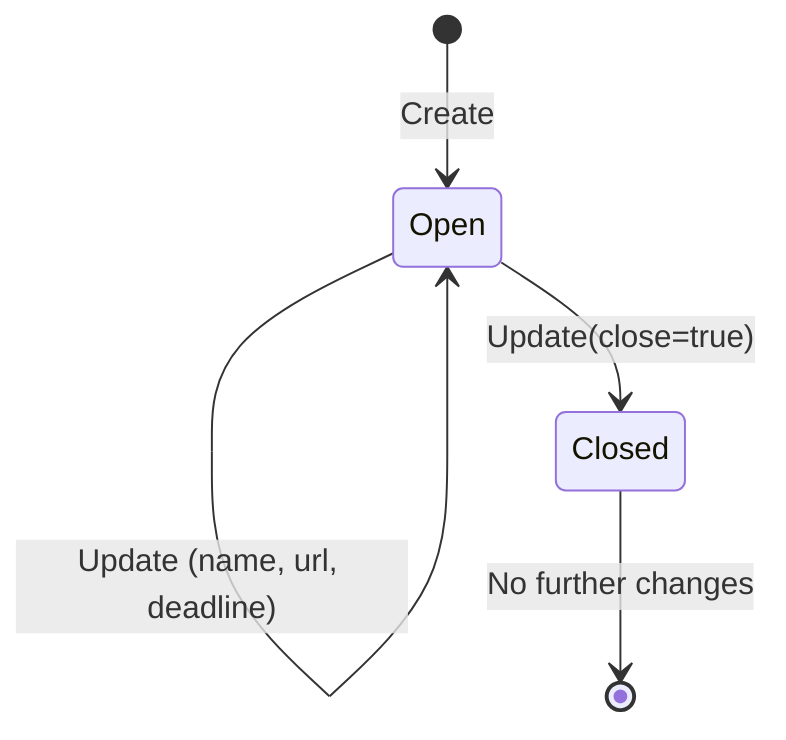

**Explanation:** The state diagram shows the lifecycle of an OrderRound. It starts in **Open** when created. While Open, it can receive AddItem, UpdateItem, RemoveItem, and Update (name, URL, deadline). The only transition out of Open is to **Closed**, triggered when the creator sets `close=true`. Once Closed, the round is final and no further changes are allowed.

---

## 7. Deployment / Runtime Flow

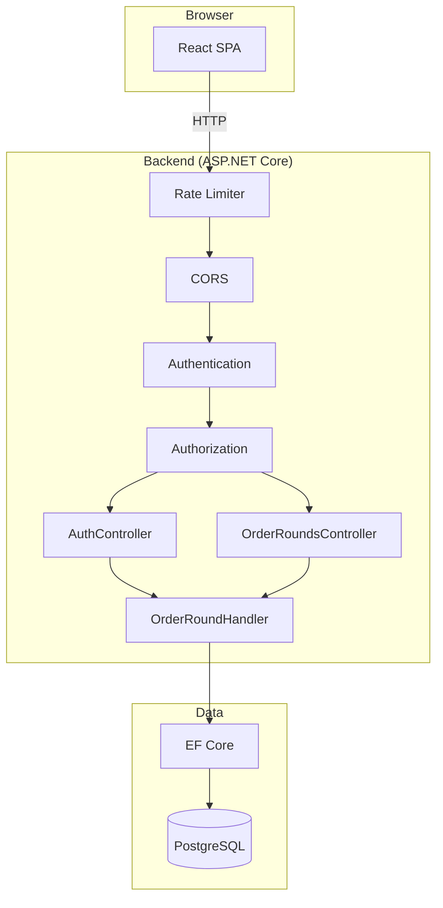

**Explanation:** This diagram shows the runtime path of a request. The React SPA in the browser sends HTTP requests to the backend. Requests pass through **Rate Limiter** (auth endpoints), **CORS** (origin check), **Authentication** (JWT validation), and **Authorization** (role/permission check) before reaching the controllers. The controllers use OrderRoundHandler, which uses EF Core to read and write PostgreSQL. AuthController and OrderRoundsController use the handler; auth is Cognito JWT only.

---

## 8. Request Pipeline (Backend)

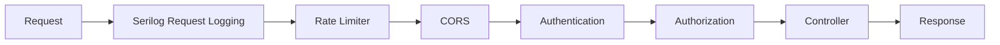

**Explanation:** The request pipeline shows the order of middleware. Each incoming request passes through: (1) **Serilog** logs the request, (2) **Rate Limiter** enforces limits on auth endpoints, (3) **CORS** validates the Origin header, (4) **Authentication** validates the JWT and sets the user principal, (5) **Authorization** checks permissions, (6) the **Controller** handles the request and returns a response. This order is fixed; e.g. authentication must run before authorization.

---

*Frontend: see [MIRA Frontend](#mira-frontend) above.*
