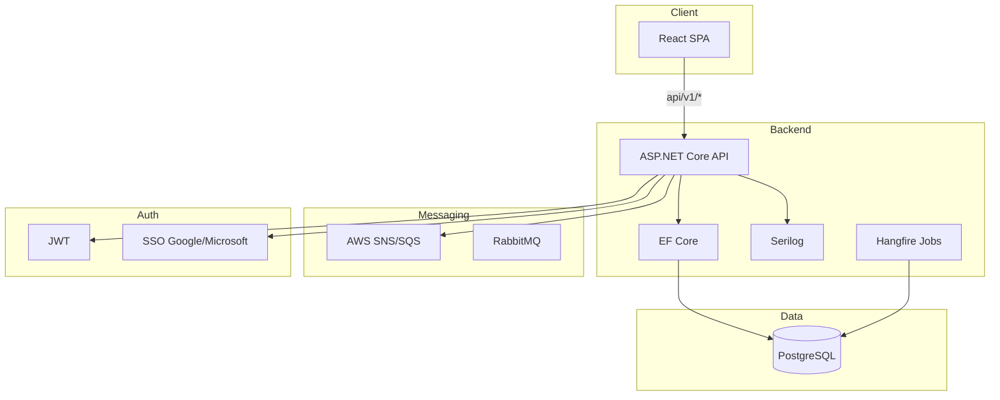
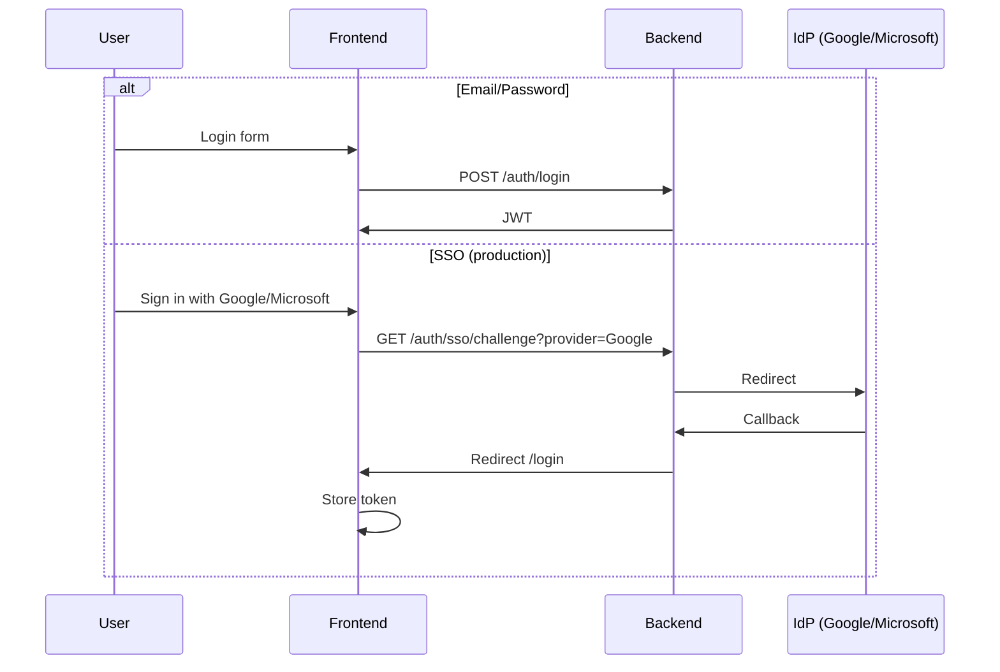

# 1. Hands-On Task – MVP

## 🎯 Overview of Approach

The objective was to build a practical food coordination system that:

- Works in a real office environment
- Is simple to use
- Is easy to extend
- Can scale to AWS if needed

I intentionally chose:

- React (TypeScript) for modern UI
- ASP.NET Core Web API for backend
- EF Core for data access
- A clean separation between frontend and backend

The design prioritizes clarity and maintainability over premature optimization.

---

## 🧠 Assumptions

- Users belong to companies located in HIVE
- Orders are occasional (not high frequency)
- One person usually organizes each round
- Payment handling is out of MVP scope
- System initially internal-only

---

## 🏗 Architecture

The codebase uses **Vertical Slice Architecture** – features are organized by capability rather than technical layer. Each slice contains everything needed for that feature (endpoints, handlers, DTOs, pages, hooks).

### Backend Structure

```
backend/
├── Shared/           # Cross-cutting concerns
│   ├── Data/         # DbContext, DbInitializer
│   ├── Events/       # Domain events, MassTransit consumers
│   ├── HttpClients/  # Refit clients, resilience
│   ├── Identity/     # ApplicationUser
│   └── Infrastructure/ # EmailService, ConfigureSwaggerOptions
├── Features/
│   ├── Auth/         # AuthController, SsoController, JwtTokenService
│   ├── Bot/          # Teams bot, link service
│   ├── Jobs/         # Hangfire jobs (recurring, reminders)
│   ├── OrderRounds/  # OrderRoundsController, OrderRoundHandler
│   ├── Payments/     # Stripe, PaymentService, webhook
│   └── RecurringOrders/ # RecurringOrderTemplate CRUD
└── Program.cs
```

### Event-Driven Architecture

Workflows are decoupled via **MassTransit** with environment-based transport:

- **Production**: **AWS SNS + SQS** (pub/sub) – MassTransit.AmazonSQS publishes to SNS topics, SQS queues subscribe; Apache 2.0 licensed
- **Development**: **RabbitMQ** (Docker) – when `RabbitMQ:Host` is set
- **Tests**: **InMemory** – when neither AWS nor RabbitMQ is configured

Events: **OrderRoundCreatedEvent**, **OrderItemAddedEvent**, **OrderRoundClosedEvent**, **PaymentCompletedEvent**. Consumers process asynchronously (logging, integrations). Jobs (recurring rounds, deadline reminders) are persisted in **PostgreSQL** via Hangfire.

### Frontend Structure

```
frontend/src/
├── app/              # App, routes, provider
├── config/           # env
├── lib/              # API client
├── providers/        # auth-provider
├── components/       # protected-route, error-boundary
├── features/
│   ├── auth/         # login-page, register-page
│   └── order-rounds/ # routes, hooks, types
└── main.tsx
```

### System Flow



### Authentication Flow



### Frontend

React SPA:

- JWT-based authentication
- Protected routes
- Order management views
- Simple and intuitive UX

Responsibilities:
- Display order rounds
- Add/edit order items
- Show deadline countdown
- Provide summary export

---

### Backend

ASP.NET Core Web API (.NET 10):

Responsibilities:
- Authentication (ASP.NET Identity, JWT, SSO Google/Microsoft)
- Email confirmation
- Order management logic
- Validation & authorization
- Business rules enforcement
- Structured logging (Serilog)
- Health probes (/health, /health/ready, /health/live)

---

### Database

Entities:

User (ASP.NET Identity)
- Id
- Email
- Company
- EmailConfirmed

OrderRound
- Id
- RestaurantName
- RestaurantUrl
- CreatedByUserId
- Deadline
- Status (Open / Closed)

OrderItem
- Id
- OrderRoundId
- UserId
- Description
- Price
- Notes

---

## ⚖️ Decisions & Trade-offs

### SPA + API Separation

Pros:
- Clean separation of concerns
- Easier future mobile/PWA expansion
- Frontend and backend scalable independently

Trade-off:
- Requires JWT handling and CORS setup

---

### Monolithic Backend (for MVP)

Pros:
- Simpler deployment
- Lower operational overhead

Trade-off:
- Would modularize into services only if scale increases

---

### PostgreSQL + Docker

Pros:
- Consistent environment across dev and production
- Strong concurrency and transaction support
- One-command setup via `docker compose up`
- Easy to add Redis, MailHog, etc. to the stack

Trade-off:
- Requires Docker; local dev without Docker needs PostgreSQL installed

---

## 🚀 What I Would Do Next

| Item | Approach |
|------|----------|
| **Microsoft Teams bot** | Bot Framework / Bot Builder SDK; webhook endpoint; extend OrderRounds API |
| **Payment (Stripe)** | Stripe Checkout or Elements; Payment entity; webhook for `payment_intent.succeeded` |
| **Recurring orders** | Background scheduler (Hangfire/Quartz); RecurringOrder template; cron-style rules |
| **Multi-tenant RBAC** | TenantId on entities; row-level security; admin dashboard for tenant management |
| **AWS deployment** | ECS/Fargate or EKS; RDS PostgreSQL; S3 + CloudFront for frontend; SES for email |

## Low-Level Diagrams

See [docs/system-architecture-diagrams.md](docs/system-architecture-diagrams.md) for domain model, ER, sequence, process, component, state, and pipeline diagrams.

## ✅ Implemented Beyond MVP

- SSO (Google & Microsoft, production only)
- Serilog structured logging
- Health probes (readiness/liveness)
- SonarAnalyzer & .editorconfig
- React error boundaries
- API versioning & Swagger descriptions
- **global.json** – SDK version pinning
- **JsonPropertyName** – camelCase annotations on all DTOs
- **Event-driven** – MassTransit + RabbitMQ; domain events published and consumed asynchronously
- **Hangfire** – Jobs persisted in PostgreSQL; recurring rounds, deadline reminders