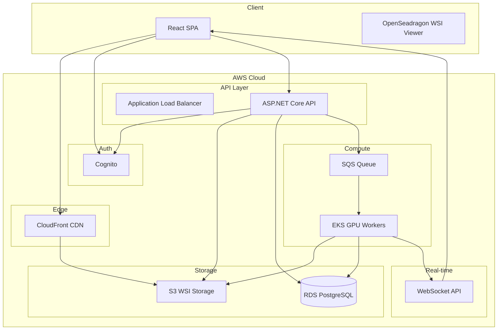

# 2. High-Level Task – AWS Cloud Platform for Digital Pathology AI

Cloud-native AI platform for Whole Slide Image (WSI) analysis, built on AWS to ensure scalability, security, and compliance with medical data requirements.

**Tech stack:** AWS, ASP.NET Core (.NET 8), React (TypeScript), GPU-based inference on EKS

---

## 2.1 System Architecture

### Goals

- Secure medical data handling
- Scalable GPU inference
- Efficient WSI management (up to 100,000 × 100,000 pixels)
- Enterprise integration (HIS/EHR)
- Future multi-modal AI support (natural language interaction)

### End Users

- Pathologists and medical doctors
- Hospitals and diagnostic laboratories
- Potentially end-consumers seeking direct diagnostic services

### Model Tasks

- **Segmentation** – Region delineation in tissue
- **Classification** – Slide or region categorization
- **Detection** – Localization of structures or anomalies

### Core Platform Flow

1. Upload pathology images securely
2. Trigger automated AI-based analysis
3. Visualize and interpret results through an intuitive web interface

---

### Main Components and Tool Choices

| Component | AWS Service | Why |
|-----------|-------------|-----|
| WSI Storage | S3 | Object storage for large binaries; lifecycle policies; HTTP range requests for partial reads |
| Metadata | RDS PostgreSQL | Relational model for jobs, users, audit; ACID; row-level security for multi-tenant |
| Inference | EKS + GPU node groups | Orchestration, auto-scaling, GPU workloads |
| Job Queue | SQS | Decouples API from workers; retries; backpressure |
| Auth | Cognito | Healthcare identity, MFA, compliance; B2B support |
| Real-time | AppSync (GraphQL) or WebSocket API | Push job status to UI |
| CDN | CloudFront | Tile delivery for WSI viewer; lower latency |
| Monitoring | CloudWatch, X-Ray | Logs, metrics, tracing |

---

### Architecture Diagram

---

### System Flow

1. User logs in via Cognito
2. Upload WSI via presigned S3 URL
3. Metadata stored in RDS PostgreSQL
4. API publishes job to SQS
5. GPU worker (EKS) processes image tiles
6. Results stored in S3
7. Job status updated in RDS
8. WebSocket/AppSync notifies frontend

---

## 2.2 Scalable GPU-Based Inference

### Strategy

- Containerized inference service
- EKS GPU node groups (e.g. p3/p4 instances)
- Auto-scaling based on SQS queue length (KEDA or custom)
- Spot/Preemptible instances for cost optimization
- Maintain a small warm GPU pool for low latency

### Large Image Handling

- **Scale:** WSIs up to 100,000 × 100,000 pixels
- **Tile-based processing:** 256×256 or 512×512 tiles
- **Range requests** from S3 for partial reads
- **Parallel tile inference** across GPU workers
- **Aggregated result stitching** for final output

### Cost Efficiency

- Spot instances for non-critical workloads
- Scale-to-zero or minimum when idle
- Tiered storage (S3 Standard vs Glacier for archives)
- Reserved capacity for predictable load

### User Progress and Status

- WebSocket/AppSync push notifications
- Optional email alerts on completion
- Job status API with polling fallback

---

## 2.3 Large File Handling

WSIs are multi-resolution and very large. Viewers (e.g. [LazySlide](https://lazyslide.readthedocs.io/en/latest/tutorials/intro_wsi.html)) load only the visible region at the appropriate resolution. When the view changes, different parts/resolutions are loaded as small compressed chunks.

### Client-Side Bottlenecks

- **Bandwidth and latency** for tile fetches
- **Concurrent request limits** (browser, CDN)
- **Client memory** for decoded tiles
- **Prefetching** for smooth panning/zooming

### Cloud-Side Bottlenecks

- **S3 I/O** for range requests
- **CloudFront cache hit rate** for popular tiles
- **Origin load** on cache miss
- **Egress cost** for large tile volumes

### Mitigation Mechanisms

- **HTTP range requests** for partial reads
- **Tile pyramid** (multi-resolution levels)
- **Client-side LRU tile cache**
- **CloudFront** for tile delivery
- **Prefetch adjacent tiles** on view change
- **WebGL acceleration** in the viewer (e.g. OpenSeadragon)

---

## 2.4 Project Management

### Prioritization (MVP Thinking)

**Phase 1 – MVP**

- Authentication (Cognito)
- Upload pipeline (S3 presigned URLs)
- Single GPU worker
- Basic WSI viewer (OpenSeadragon)
- Manual analysis trigger

Goal: End-to-end working system.

**Phase 2 – Scalability**

- SQS queue
- EKS auto-scaling
- WebSocket/AppSync integration
- Monitoring dashboards (CloudWatch)
- CI/CD

**Phase 3 – Advanced AI**

- Multi-modal conversational interface
- LLM integration
- Annotation collaboration
- Compliance hardening (GDPR, HIPAA, MDR/IVDR)
- Enterprise audit logging

---

### Build vs Buy

| Area | Approach | Rationale |
|------|----------|------------|
| WSI viewer | OpenSeadragon (OSS) | Mature, pyramid support |
| Auth | Cognito | Managed, compliant |
| Storage | S3 | Managed object storage |
| Inference runtime | Custom container | Model-specific |
| Job queue | SQS | Managed messaging |
| Annotation UI | Custom or integrate | Depends on clinical workflow |

---

### Own vs Outsource vs Hire

- **Own:** Architecture, API design, integration, orchestration, core backend
- **Freelancers:** Frontend polish, one-off integrations, documentation, UI/UX
- **Hired:** DevOps, ML infrastructure, security/compliance, clinical advisor

---

### Hiring Strategy

| Role | When | Why |
|------|------|-----|
| DevOps / ML infrastructure | Early | CI/CD, GPU clusters, scaling |
| Security / compliance | Before production | Medical data, regulations |
| Frontend performance | When viewer UX is critical | Large images, responsiveness |
| Clinical advisor | For validation | Workflow and clinical accuracy |

---

## Architectural Philosophy

- Use managed AWS services where possible
- Decouple compute from API
- Design for compliance from day one
- Keep ML services containerized
- Build modular for future multi-modal AI integration
