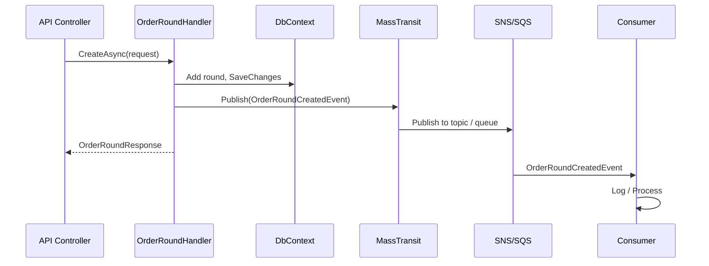
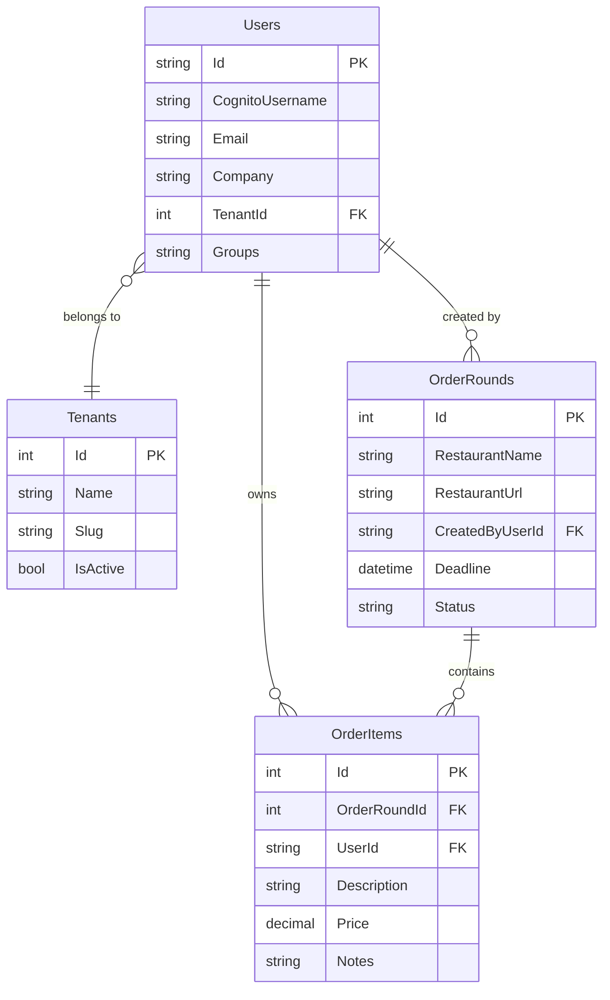
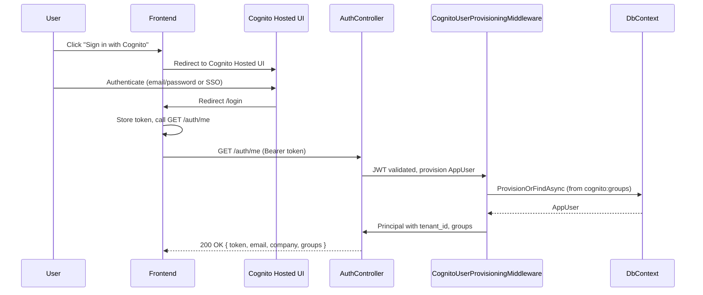
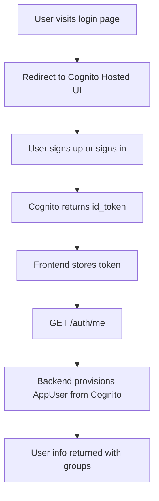
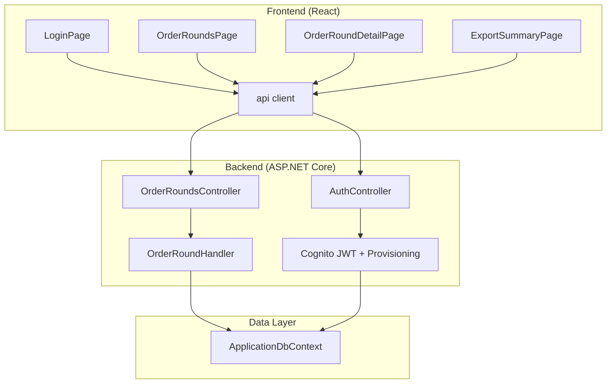
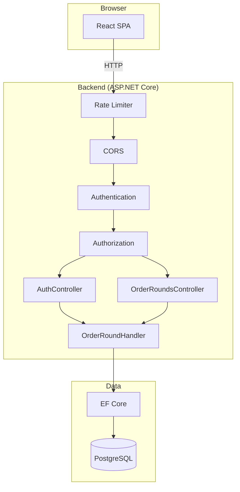

# Low-Level System Architecture – UML Diagrams

This document contains process diagrams, flowcharts, sequence diagrams, and domain model diagrams for the HIVE Food Ordering system. Each diagram is followed by a written explanation.

---

## 1. Domain Model (Class Diagram)

### Event-Driven Flow

**Explanation:** After a handler persists state, it publishes domain events via MassTransit. **Production**: events go to AWS SNS (topics), which fan out to SQS queues; consumers process from SQS. **Development**: LocalStack (SQS/SNS emulation). **Tests**: InMemory. All transports use open-source libraries (MassTransit, AWS SDK: Apache 2.0).

---

**Explanation:** This class diagram shows the core domain entities and their relationships. **AppUser** is provisioned from AWS Cognito (Id = Cognito sub); it has `Company` and `Groups` (cached from cognito:groups). Each user can create many **OrderRounds** (one-to-many) and own many **OrderItems** (one-to-many). An **OrderRound** has a restaurant name, URL, deadline, and status (Open or Closed); it contains many **OrderItems**. Each **OrderItem** belongs to one round and one user, and has description, price, and optional notes. The arrows indicate cardinality: `1` → `*` means one entity relates to many.

---

## 2. Entity Relationship Diagram

**Explanation:** This ER diagram shows the database schema. **Users** stores Cognito-provisioned users (Id = Cognito sub); **Groups** is a comma-separated list of Cognito group names (e.g. Admins, Managers, Users). **OrderRounds** has a foreign key to the user who created it. **OrderItems** references both the order round and the user who added it. PK = primary key, FK = foreign key. The `||--o{` notation means "one to many" (one user creates many rounds; one round contains many items).

---

## 3. Sequence Diagrams

Sequence diagrams show the order of messages between components over time. Read from top to bottom; arrows indicate requests (solid) and responses (dashed). `alt` blocks show alternative paths.

### 3.1 Cognito Login Flow

**Explanation:** Authentication uses AWS Cognito for all environments. The user clicks "Sign in with Cognito" and is redirected to Cognito Hosted UI. After authenticating (email/password or SSO via Cognito Identity Providers), Cognito redirects back with an id_token. The frontend stores the token and calls `GET /auth/me`. The backend validates the JWT, provisions or finds the AppUser from Cognito claims (including cognito:groups), and returns user info. Groups (e.g. Admins, Managers, Users) are used for authorization.

### 3.2 Create Order Round Flow

**Explanation:** The user submits the create-round form. The frontend sends `POST /api/v1/orderrounds` with the JWT in the Authorization header. The controller extracts the user ID from the token and delegates to OrderRoundHandler. The handler creates an OrderRound, saves it to the database, and returns the response. The API responds with 201 Created and a Location header; the frontend navigates to the new round's detail page.

### 3.3 Add Item to Order Round Flow

**Explanation:** The user adds an item on the order round detail page. The frontend sends `POST /api/v1/orderrounds/:id/items` with the JWT. The handler first checks that the round exists, is Open, and the deadline has not passed. If any check fails, it returns 400. Otherwise, it creates the OrderItem, saves it, and returns 201 Created.

---

## 4. Process Diagrams (Flowcharts)

Flowcharts show decision points and process steps. Diamonds are decisions; rectangles are actions. Arrows show flow direction.

### 4.1 Cognito Registration / Login

**Explanation:** Registration and login are handled entirely by AWS Cognito. Users sign up and sign in via Cognito Hosted UI. The frontend receives an id_token, stores it, and calls `GET /auth/me` to provision the AppUser in the backend and get user info (including groups).

### 4.2 Order Round Lifecycle

**Explanation:** An order round starts in **Open** state when created. While open, users can add, update, or remove items until the deadline passes. After the deadline, no new items can be added, but the round stays Open. Only the creator can **close** the round (Status = Closed). Once closed, no updates are allowed.

### 4.3 Add Item Decision Flow

**Explanation:** Adding an item requires three checks: (1) the round must exist (otherwise 404), (2) the round must be Open (otherwise 400), and (3) the deadline must not have passed (otherwise 400). Only if all pass does the system create the item and return 201.

### 4.4 Authentication Decision Flow

**Explanation:** Every request to a protected endpoint (e.g. order rounds) must include a valid Bearer token. If missing or invalid, the API returns 401. If valid, the user ID is extracted from the JWT claims and the request proceeds.

---

## 5. Component Diagram

**Explanation:** The component diagram shows how the application is split into layers. The **frontend** has main pages and a shared API client (Axios). Login redirects to Cognito Hosted UI; the API client calls AuthController (`/auth/me`) and OrderRoundsController. The **backend** uses Cognito JWT validation and CognitoUserProvisioningMiddleware to provision AppUser from Cognito claims. The **data layer** uses ApplicationDbContext (EF Core) with a Users table (no ASP.NET Identity).

---

## 6. State Diagram – OrderRound

**Explanation:** The state diagram shows the lifecycle of an OrderRound. It starts in **Open** when created. While Open, it can receive AddItem, UpdateItem, RemoveItem, and Update (name, URL, deadline). The only transition out of Open is to **Closed**, triggered when the creator sets `close=true`. Once Closed, the round is final and no further changes are allowed.

---

## 7. Deployment / Runtime Flow

**Explanation:** This diagram shows the runtime path of a request. The React SPA in the browser sends HTTP requests to the backend. Requests pass through **Rate Limiter** (auth endpoints), **CORS** (origin check), **Authentication** (JWT validation), and **Authorization** (role/permission check) before reaching the controllers. The controllers use OrderRoundHandler, which uses EF Core to read and write PostgreSQL. AuthController and OrderRoundsController use the handler; auth is Cognito JWT only.

---

## 8. Request Pipeline (Backend)

**Explanation:** The request pipeline shows the order of middleware. Each incoming request passes through: (1) **Serilog** logs the request, (2) **Rate Limiter** enforces limits on auth endpoints, (3) **CORS** validates the Origin header, (4) **Authentication** validates the JWT and sets the user principal, (5) **Authorization** checks permissions, (6) the **Controller** handles the request and returns a response. This order is fixed; e.g. authentication must run before authorization.
